# Contributing

Thanks for your interest in Dreamcoder OS! This project is a personal dotfiles
repository with an open-source theme engine. Contributions, ideas, and bug
reports are welcome.

## Project Structure

```
src/dreamcoder_theme/     # Python theme engine (pip-installable package)
  ├── palette.py              # Color math, adaptive palette derivation
  ├── palette_tokens.py       # Static design tokens (dark/light/dusk)
  ├── renderers.py            # Public renderer import hub
  ├── renderers_kitty.py      # Kitty format renderer
  ├── renderers_ghostty_warp.py
  ├── renderers_codex.py
  ├── renderers_opencode.py
  ├── renderers_pi.py
  ├── renderers_starship.py
  ├── renderers_tmux.py
  ├── renderers_antigravity.py
  ├── renderers_readme.py
  ├── renderers_hypr_waybar_rofi.py
  ├── renderers_extra_nvim.py      # Nvim + LSP + plugins + syntax + UI
  ├── renderers_extra_obsidian.py
  ├── renderers_extra_bat_delta.py
  ├── renderers_extra_btop.py
  ├── renderers_extra_firefox.py
  ├── renderers_extra_notify.py    # Dunst, Cava
  ├── renderers_extra_shell.py     # Zsh, LS_COLORS, fzf
  ├── sync.py                  # Theme file orchestration
  ├── control.py               # CLI entry point
  ├── writers.py               # Filesystem writers & config updaters
  ├── settings.py              # Paths, mode, adaptive configuration
  ├── core.py                  # Core path utilities
  ├── doctor.py                # Health checks
  ├── dashboard.py             # Control center dashboard
  ├── cli_parser.py            # CLI argument parser
  ├── cli_handlers.py          # CLI command handlers
  ├── installer.py             # Dotfiles installer
  ├── repair_engine.py         # Repair after updates
  ├── profiles.py              # ML4W profile management
  ├── backups.py               # Theme backup/restore
  ├── audit.py                 # Theme audit & validation
  ├── docs_report.py           # Documentation health report
  ├── motion.py                # Day/night mode scheduler
  ├── tui.py                   # Terminal UI
  ├── visual_regression.py     # Visual regression testing
  └── settings_store.py        # Settings persistence
tests/                        # pytest test suite
shell-tests/                  # bats tests for shell scripts
docs/                         # Documentation hub
scripts/                      # Shell automation scripts
themes/dreamcoder/            # Generated theme files (output)
```

Each terminal/shell/editor lives in its own top-level directory
(`Kitty/`, `Ghostty/`, `Nvim/`, etc.) and is installed via GNU Stow.

## Development Setup

```bash
# Clone and enter
git clone git@github.com:Gentleman-Programming/dreamcoder-dots.git
cd dreamcoder-dots

# Install with dev dependencies (using pip)
pip install -e ".[dev]"

# Or using uv (recommended)
uv pip install -e ".[dev]"
```

## Quality Commands

The project provides a `Makefile` with common quality commands:

```bash
make lint          # ruff check + ruff format --check + shellcheck + mypy
make test          # pytest tests/ -v
make coverage      # pytest --cov=dreamcoder_theme --cov-report=term-missing
make format        # auto-format all Python files with ruff
make type-check    # mypy src/ (strict mode)
make python-lint   # ruff only
make shell-lint    # shellcheck on scripts/*.sh
make clean         # remove build artifacts
make build         # build wheel + source tarball
```

Or run tools individually:

```bash
# Full test suite
pytest

# With coverage
pytest --cov=dreamcoder_theme --cov-report=term-missing

# Specific test file
pytest tests/test_palette.py -v
```

## Linting

```bash
# ruff for Python
ruff check src/dreamcoder_theme/

# auto-fix
ruff check --fix src/dreamcoder_theme/

# shellcheck for shell scripts
shellcheck --shell=bash scripts/*.sh
```

## Pre-commit Hooks

The project uses pre-commit to enforce quality on every commit. Install it:

```bash
pip install pre-commit
pre-commit install
```

After installation, the following checks run automatically before each commit:

| Hook | Tool | Description |
|------|------|-------------|
| trailing-whitespace | pre-commit-hooks | Remove trailing whitespace |
| end-of-file-fixer | pre-commit-hooks | Ensure files end with newline |
| check-yaml | pre-commit-hooks | Validate YAML syntax |
| check-json | pre-commit-hooks | Validate JSON syntax |
| ruff | ruff-pre-commit | Lint + auto-fix Python |
| ruff-format | ruff-pre-commit | Format Python with ruff |
| mypy | mypy | Type check (strict mode) |
| shellcheck | shellcheck-py | Static analysis for shell scripts |
| dreamcoder-theme-validate | custom | Validate theme token health |
| dreamcoder-preview-regenerate | custom | Regenerate theme preview |

Run all hooks manually at any time:

```bash
pre-commit run --all-files
```

To skip hooks for a WIP commit (use sparingly):

```bash
git commit --no-verify -m "wip: ..."
```

## Building

```bash
# Build wheel + source tarball
python -m build

# Or via Makefile
make build
```

## How to Add a New Renderer

Los renderers siguen una arquitectura de funciones puras. Agregar un nuevo target
sigue este flujo:

```mermaid
flowchart LR
    A["1. Create renderer_<target>.py<br/>Define content(target_colors) → str"] --> B
    B["2. Export from renderers.py<br/>Add import + __all__ entry"] --> C
    C["3. Add write call to sync.py<br/>write_if_changed(path, content(active))"] --> D
    D["4. Add path to settings.py<br/>theme_paths() namedtuple"] --> E
    E["5. Add paths to control.py<br/>path generation if needed"] --> F
    F["6. Add print to sync_summary()<br/>Show path + changed status"] --> G
    G["7. Write tests<br/>tests/test_renderer_<target>.py"] --> H
    H["8. Add variant files if needed<br/>sync_repo_snippets() write_variant_files()"]
```



### Checklist

- [ ] `renderers_<target>.py` — función pura que recibe `dict[str, str]` y devuelve `str`
- [ ] Registrada en `renderers.py` (import + `__all__`)
- [ ] Llamada en `sync.py` → `sync_active_targets()` o `sync_repo_snippets()`
- [ ] Path definido en `settings.py` → `theme_paths()`
- [ ] Path generado en `control.py` si aplica
- [ ] `print_summary()` muestra el nuevo target
- [ ] Tests en `tests/`

## Pull Request Guidelines

- Keep changes focused — one feature/fix per PR.
- Add tests for new functionality.
- Ensure `make lint && make test && make coverage` passes before opening the PR.
- Follow existing code style (ruff defaults, 100 chars line length).
- Keep the CHANGELOG updated under `## Unreleased`.
- Pre-commit hooks must pass before committing.

## Design Principles

- **Health first**: colors must pass WCAG AA contrast ratios.
- **Single source of truth**: edit tokens in `palette_tokens.py`, not in
  individual theme files.
- **Renderers are pure**: each renderer takes a color dict and returns a
  string — no side effects.
- **Stow-compatible**: file paths in the repo mirror `$HOME` layout so GNU
  Stow can link them directly.
