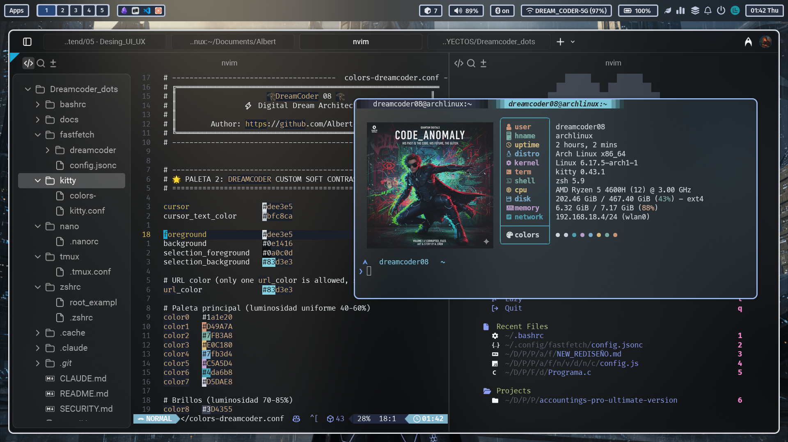

# 🚀 Dreamcoder Dotfiles v4.0

<div align="center">
  
  <p><em>"Engineering Excellence for the Arch Linux Dreamcoder"</em></p>
</div>

[](https://archlinux.org/)
[](https://neovim.io/)
[](https://www.gnu.org/software/stow/)
[](./.gemini/skills)

Bienvenido a la versión **Senior** de Dreamcoder Dotfiles. Este no es solo un conjunto de configuraciones; es un entorno de ingeneria de softwart modular, portable y potenciado por IA, diseñado para Web Developers que exigen rendimiento y orden.

---

## 🏛️ Arquitectura Modular (Dreamcoder Style)

Siguiendo las mejores prácticas de ingeneria de softwart, este repositorio ha abandonado los scripts monolíticos por una estructura de **módulos independientes** gestionados por **GNU Stow**.

```text
Dreamcoder_dots/
├── DreamcoderNvim/      # 🧠 El Cerebro: IDE profesional (LazyVim + Node Fix)
├── DreamcoderShell/     # 🐚 La Voz: Zsh, Bash, Starship (Neon Cyber)
├── DreamcoderFish/      # 🐟 La Velocidad: Fish Shell (Modern, Non-POSIX)
├── DreamcoderNushell/   # 📊 Los Datos: Nushell (Structured Data Shell)
├── DreamcoderClaude/    # 🤖 La Inteligencia: Claude Desktop Config & Skills
├── DreamcoderOpenCode/  # ⚡ El Open Source: Config para OpenCode AI
├── DreamcoderKitty/     # 🐱 La Ventana: Terminal acelerada por GPU
├── DreamcoderGhostty/   # 👻 El Futuro: Terminal de ultra-baja latencia
├── DreamcoderZellij/    # 🦀 El Flujo: Multiplexor en Rust (KDL layouts)
├── DreamcoderTmux/      # 🗂️ El Orden: Multiplexación clásica
├── DreamcoderInstaller/ # 🚀 El Motor: Instalador TUI en Rust (Ratatui)
├── homebrew-tap/        # 🍺 El Tap: Soporte para MacOS y Linux via Brew
├── scripts/             # 🛠️ Herramientas: Scripts de utilidad y mantenimiento
├── archive/             # 📜 Legado: Archivos antiguos y respaldos históricos
└── .gemini/skills/      # 🤖 La Inteligencia: Instrucciones maestras para IA
```

---

## 🧠 Características Principales

### 1. DreamcoderNvim (Powered by LazyVim)
Un entorno IDE completo en la terminal.
- **Node.js Fix:** Algoritmo inteligente que detecta y usa el Node del sistema (NVM/Volta) para evitar conflictos en LSPs.
- **Web Stack:** Soporte nativo y optimizado para **React 19, TypeScript, Tailwind 4 y Rust**.
- **IA Ready:** Preparado para integrarse con Avante, Copilot o Claude Code.

### 2. IA Skills (Contexto Real)
Tu IA ahora sabe cómo trabajas. He integrado **Skills** maestras en `.gemini/skills/`:
- **Rust War Architecture:** Reglas para arquitectura hexagonal y estabilidad SUNAT-grade.
- **Senior Web Dev:** Estándares modernos de React y Bun.
- **Arch Security:** Auditoría de seguridad y privacidad automática.

### 3. Despliegue con GNU Stow
Adiós a `cp`. Usamos enlaces simbólicos (`symlinks`). Lo que editas en tu sistema se refleja instantáneamente en el repositorio.

---

## 🛠️ Instalación Rápida

### Arch Linux (Recomendado)
```bash
git clone https://github.com/Albert-fer02/Dreamcoder_dots.git
cd Dreamcoder_dots
chmod +x install.sh
./install.sh
```

### Dev Containers (Cloud Ready) ☁️
Si usas VS Code o GitHub Codespaces, este repositorio incluye una configuración lista para usar.
1. Abre el repositorio en VS Code.
2. Click en "Reopen in Container".
3. Tendrás un entorno Arch Linux completo con todas las herramientas de Dreamcoder preinstaladas.

### Multi-OS (MacOS / Linux via Homebrew)
```bash
brew tap Albert-fer02/dreamcoder-dots
brew install dreamcoder-dots
dreamcoder-dots
```

> **Nota:** El instalador es inteligente. Si ya tienes los paquetes instalados, usa `./install.sh --skip-pkg`.

---

## ✅ Auditoría y Calidad

Un ingeniero no asume que todo funciona; lo verifica. Hemos incluido un auditor de integridad:

```bash
./verify.sh
```

**¿Qué verifica?**
- **Integridad de Links:** Asegura que tus configs estén correctamente enlazadas a través de Stow.
- **Sintaxis Lua:** Valida tu config de Neovim en modo headless.
- **Sintaxis Shell:** Comprueba errores en tu `.zshrc`.
- **IA Skills:** Valida la presencia de tus instrucciones maestras.

---

## 🎨 Personalización

Dreamcoder Dotfiles utiliza un enfoque híbrido para el prompt, priorizando la estética y el rendimiento:

- **Zsh (Senior Edition):** Utiliza **Powerlevel10k** con un diseño de dos líneas premium (como se ve en la captura de referencia), permitiendo la flecha debajo de la información para máximo espacio.
- **Fish / Nushell / Bash:** Utilizan **Starship** con el tema **DreamCoder Verse** para una experiencia visual consistente y moderna.
- **Terminal:** Kitty y Ghostty con esquemas de color optimizados para resaltar la estética Neon Cyber.

---

## 🤝 Créditos e Inspiración
Este proyecto ha evolucionado de un repo personal a un entorno de ingeneria de softwart gracias a la inspiración de:
- **Dreamcoder.Dots:** Por la modularidad y el fix de Node.js.
- **LazyVim:** Por la base de Neovim más robusta del planeta.

---
<div align="center">
  <p>Desarrollado con ❤️ para la comunidad de Arch Linux.</p>
  <p><strong>Dreamcoder: Code like a god, deploy like a dreamcoder.</strong></p>
</div>