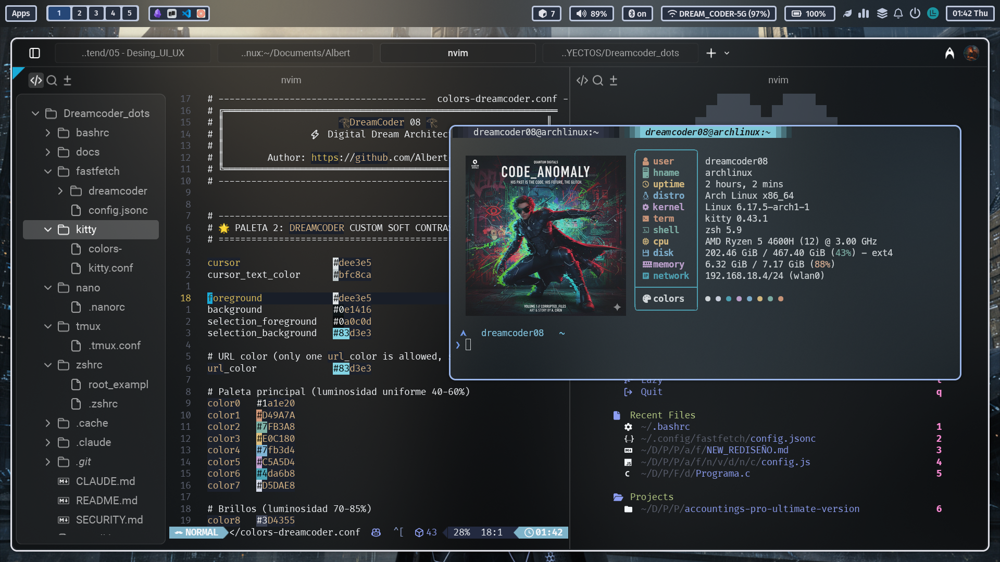

# DreamcoderDots

<div align="center">
  
  <p><em>Custom Arch Linux workstation engineered for terminal velocity, modular tooling, and visual polish</em></p>
</div>

[](https://archlinux.org/)
[](https://www.gnu.org/software/stow/)

DreamcoderDots is not a generic dotfiles dump. It is a curated Arch Linux environment built as a reproducible workstation system: shell orchestration, terminal tooling, editor setup, AI-assist layers, and visual customization designed to work together instead of drifting as disconnected configs.

The repo currently includes a real mix of system and presentation layers: `Shell`, `GLSL`, `Lua`, `Rust`, `TypeScript`, plus supporting tooling for verification and installation.

## Why It Matters

- Built as a system, not as ad-hoc config fragments.
- Prioritizes reproducibility through `GNU Stow`, `Make`, install scripts, and validation flows.
- Combines workstation ergonomics with visual identity through terminal theming and shader-driven polish.
- Useful as a public proof of developer experience, environment engineering, and Arch Linux fluency.

## Quick Start

```bash
git clone https://github.com/Albert-fer02/Dreamcoder_dots.git
cd Dreamcoder_dots
make install
```

## Core Modules

- `shell`, `fish`, `nushell`: layered shell environments, aliases, and reusable functions.
- `kitty`, `ghostty`, `tmux`, `zellij`: terminal and session orchestration.
- `nvim`: editor environment and plugin-driven productivity setup.
- `fastfetch`: machine identity and system snapshot presentation.
- `claude`, `opencode`: AI-assist and local workflow augmentation.
- `DreamcoderInstaller`: Rust-based installer work.
- `homebrew-tap`, `infra`, `arkonyx_core`: supporting system and product-side experimentation tied to the workstation.

## Structure

```
Dreamcoder_dots/
├── shell/              # Core shell layer and reusable command modules
├── fish/               # Fish shell setup
├── nushell/            # Nushell setup
├── kitty/              # Kitty terminal config
├── ghostty/            # Ghostty terminal config
├── tmux/               # Tmux multiplexer config
├── zellij/             # Zellij session config
├── nvim/               # Neovim environment
├── gitconfig/          # Git settings
├── fastfetch/          # Machine/system presentation
├── claude/             # AI workflow helpers
├── opencode/           # Themes and skill integrations
├── DreamcoderInstaller/# Rust installer
├── scripts/            # Install and verification scripts
├── tests/              # Validation entrypoints
├── docs/               # Documentation
└── Makefile            # Task runner
```

## Commands

| Command | Description |
|---------|-------------|
| `make install` | Run the full install flow via `scripts/install.sh` |
| `make stow` | Deploy configured modules via GNU Stow |
| `make unstow` | Remove deployed symlinks |
| `make backup` | Backup existing shell and config state |
| `make restore` | Restore the latest backup |
| `make test` | Run the validation suite |
| `make verify` | Execute post-install verification |
| `make status` | Check module stow status |
| `make check-deps` | Ensure required dependencies exist |

## Architecture

- **Modular**: each top-level folder maps to a tool or subsystem.
- **Reproducible**: install, stow, backup, restore, and verify flows are first-class.
- **Portable-first**: avoids hardcoded assumptions where possible.
- **Operator-focused**: optimized for daily use, not just for screenshots.
- **Extensible**: includes room for Rust tooling, AI helpers, and future system layers.

See [docs/ARCHITECTURE.md](docs/ARCHITECTURE.md) for details.

## Requirements

- Arch Linux (primary target)
- Git
- GNU Stow
- `make`

## Post-Install

1. Restart your shell: `exec $SHELL`
2. Validate the environment: `make verify`
3. Run the test suite if you changed modules: `make test`
4. Apply any tool-specific post-setup such as tmux plugin install or Neovim plugin sync
