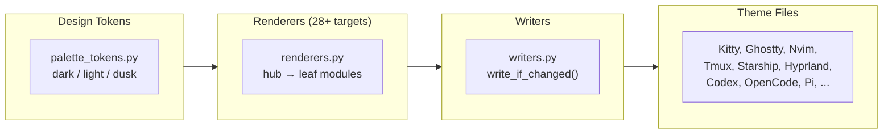

# Dreamcoder OS

[](https://github.com/Gentleman-Programming/dreamcoder-dots/actions/workflows/theme-validation.yml)
[]()
[](https://pypi.org/project/dreamcoder-theme/)
[](https://pypi.org/project/dreamcoder-theme/)
[](https://github.com/Gentleman-Programming/dreamcoder-dots/blob/main/LICENSE)

Personal Arch Linux dotfiles for the **Dreamcoder** identity: a visual layer on top of
ML4W/Gentleman Dots focused on readability, eye comfort, and a premium coding experience.


```mermaid
flowchart LR
    subgraph Tokens["Design Tokens"]
        PT["palette_tokens.py<br/>dark / light / dusk"]
    end
    subgraph Render["Renderers (28+ targets)"]
        R["renderers.py<br/>hub → leaf modules"]
    end
    subgraph Write["Writers"]
        W["writers.py<br/>write_if_changed()"]
    end
    subgraph Output["Theme Files"]
        O["Kitty, Ghostty, Nvim,<br/>Tmux, Starship, Hyprland,<br/>Codex, OpenCode, Pi, ..."]
    end
    Tokens --> Render --> Write --> Output
```

## Philosophy

Dreamcoder is not a neon rice. It is a workbench:

- **health first**: no pure black/white primary backgrounds, strong contrast, low glare;
- **daily comfort**: larger terminal type, calmer prompt density, automatic day/night mode;
- **identity second**: Cocoa/Lúcuma warmth, diagnostic cyan, restrained editorial colors;
- **ML4W-compatible**: Dreamcoder owns colors and hooks, ML4W/Gentleman can keep layout behavior.

---

## Quick Start

| Comando | Descripción |
|---------|-------------|
| `pip install dreamcoder-theme` | Instalar el theme engine |
| `dreamcoder-theme sync` | Renderizar todos los temas a los directorios de configuración |
| `dreamcoder-theme doctor` | Verificar salud de los temas instalados |
| `./scripts/dreamcoder install` | Instalación completa del dotfiles ecosystem (Hyprland, Waybar, etc.) |
| `./scripts/dreamcoder repair` | Reparar después de actualizaciones de ML4W/Gentleman |
| `./scripts/dreamcoder dark` | Forzar modo oscuro |
| `./scripts/dreamcoder light` | Forzar modo claro |
| `make lint` | Ejecutar ruff + shellcheck |
| `make test` | Ejecutar pytest |
| `make coverage` | Ejecutar pytest con cobertura |

---

## `dreamcoder-theme` — Python Package

The theme engine behind Dreamcoder OS. Generates color themes for **28+ targets** from a single
set of design tokens.

### Installation

```bash
pip install dreamcoder-theme
```

### CLI Usage

```bash
# Render all themes to your config dirs
dreamcoder-theme sync

# Check health of installed themes
dreamcoder-theme doctor

# Inspect active theme paths
dreamcoder-theme paths

# See all available commands
dreamcoder-theme --help
```

### Library Usage

```python
from dreamcoder_theme.palette import adaptive_palette
from dreamcoder_theme.renderers import kitty_content, ghostty_content

# Generate adaptive colors from a wallpaper
active = adaptive_palette(variants["dark"], wallpaper="/path/to/wallpaper.jpg")

# Render to specific formats
kitty_conf = kitty_content(active)
ghostty_conf = ghostty_content(active)
```

### What It Renders

| Category | Targets |
|---|---|
| Terminals | Kitty, Ghostty, WezTerm, Alacritty, Warp |
| Multiplexers | Tmux, Zellij |
| Shell | Starship, zsh-syntax-highlighting, LS_COLORS, fzf, Bat, Delta |
| AI Tools | OpenCode, Codex CLI, Pi CLI, Antigravity |
| Editors | Neovim (LSP, syntax, UI, plugins), VS Code |
| Desktop/WM | Hyprland, Waybar, Rofi |
| Apps | Firefox, Obsidian, Btop, Dunst, Cava |

## Architecture

El pipeline de generación de temas sigue un flujo de cuatro capas:

1. **Input Layer** — `palette_tokens.py` define los tokens de diseño estáticos (variantes dark/light/dusk)
2. **Transform Layer** — `palette.py` carga variantes, aplica paleta adaptativa desde wallpaper
3. **Render Layer** — `renderers.py` importa funciones de módulos `renderers_*.py` que convierten tokens a formatos específicos
4. **Write Layer** — `writers.py` escribe archivos via `write_if_changed()` y actualiza configuraciones de apps

Cada renderer es una función pura: recibe un dict de colores y devuelve un string.
No hay side effects hasta la capa de escritura.

Ver [diagramas de arquitectura](docs/architecture/) y [documentación completa](docs/README.md).

---

## Full Dotfiles Installation

For the complete Dreamcoder OS desktop experience (Hyprland, Waybar, wallpapers,
systemd services, and all terminal/shell configs):

```bash
git clone git@github.com:Dreamcoder08/Dreamcoder_dots.git ~/Documents/PROYECTOS/dreamcoder-dots
cd ~/Documents/PROYECTOS/dreamcoder-dots
./scripts/dreamcoder install
```

`install.sh` stows the Dreamcoder modules, installs ML4W/Waypaper hooks, enables the
day/night timer, applies the current mode, and verifies the setup.

## Quick commands

```bash
./scripts/dreamcoder install      # first install / full reapply
./scripts/dreamcoder repair       # after ML4W or Gentleman updates
./scripts/dreamcoder doctor       # inspect current health/status
./scripts/dreamcoder verify       # symlinks + starship + theme health
./scripts/dreamcoder preview      # regenerate docs/dreamcoder-theme-preview.md
./scripts/dreamcoder auto         # apply light/dark for current time
./scripts/dreamcoder light        # force light mode
./scripts/dreamcoder dusk         # force dusk transitional mode
./scripts/dreamcoder dark         # force dark mode
./scripts/set-wallpaper.sh <file> # set wallpaper and refresh Dreamcoder
```

## Post-update repair

After updating ML4W, Gentleman Dots, Waypaper, or Hyprland configs, run:

```bash
cd ~/Documents/PROYECTOS/dreamcoder-dots
./scripts/dreamcoder repair
```

This reapplies hooks, restows modules, restarts the timer, refreshes the current
theme, and runs verification.

## Development

See [CONTRIBUTING.md](CONTRIBUTING.md) for setup instructions, test runner, and
pull request guidelines. Full documentation at [docs/README.md](docs/README.md).
