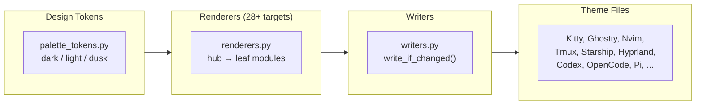

# Dreamcoder OS

[](https://github.com/Gentleman-Programming/dreamcoder-dots/actions/workflows/theme-validation.yml)
[]()
[](https://pypi.org/project/dreamcoder-theme/)
[](https://pypi.org/project/dreamcoder-theme/)
[](https://github.com/Gentleman-Programming/dreamcoder-dots/blob/main/LICENSE)

> Personal Arch Linux dotfiles — a visual layer on top of ML4W/Gentleman Dots focused on readability, eye comfort, and a premium coding experience.

Personal Arch Linux dotfiles for the Dreamcoder identity: a visual layer on top of
ML4W/Gentleman Dots focused on readability, eye comfort, and a premium coding experience.


```mermaid
flowchart LR
    subgraph Tokens["Design Tokens"]
        PT["palette_tokens.py<br/>dark / light / dusk"]
    end
    subgraph Render["Renderers (28+ targets)"]
        R["renderers.py<br/>hub → leaf modules"]
    end
    subgraph Write["Writers"]
        W["writers.py<br/>write_if_changed()"]
    end
    subgraph Output["Theme Files"]
        O["Kitty, Ghostty, Nvim,<br/>Tmux, Starship, Hyprland,<br/>Codex, OpenCode, Pi, ..."]
    end
    Tokens --> Render --> Write --> Output
```

---

## Installation

### Theme Engine (Python package)

```bash
pip install dreamcoder-theme
```

### Full Dotfiles

```bash
git clone git@github.com:Dreamcoder08/Dreamcoder_dots.git ~/Documents/PROYECTOS/dreamcoder-dots
cd ~/Documents/PROYECTOS/dreamcoder-dots
./scripts/dreamcoder install
```

---

## Usage

### CLI

```bash
# Render all themes to your config dirs
dreamcoder-theme sync

# Check health of installed themes
dreamcoder-theme doctor

# Inspect active theme paths
dreamcoder-theme paths
```

### Library

```python
from dreamcoder_theme.palette import adaptive_palette
from dreamcoder_theme.renderers import kitty_content, ghostty_content

# Generate adaptive colors from a wallpaper
active = adaptive_palette(variants["dark"], wallpaper="/path/to/wallpaper.jpg")

# Render to specific formats
kitty_conf = kitty_content(active)
ghostty_conf = ghostty_content(active)
```

### Script commands

| Command | Description |
|---------|-------------|
| `./scripts/dreamcoder install` | First install / full reapply |
| `./scripts/dreamcoder repair` | After ML4W or Gentleman updates |
| `./scripts/dreamcoder doctor` | Inspect current health/status |
| `./scripts/dreamcoder dark` | Force dark mode |
| `./scripts/dreamcoder light` | Force light mode |
| `./scripts/dreamcoder preview` | Regenerate docs preview |
| `./scripts/set-wallpaper.sh <file>` | Set wallpaper and refresh |

---

## Architecture

The theme generation pipeline follows a four-layer flow:

1. **Input Layer** — `palette_tokens.py` defines static design tokens (dark/light/dusk variants)
2. **Transform Layer** — `palette.py` loads variants and applies adaptive palette from wallpaper
3. **Render Layer** — `renderers.py` imports functions from `renderers_*.py` modules that convert tokens to target-specific formats
4. **Write Layer** — `writers.py` writes files via `write_if_changed()` and updates app configurations

Each renderer is a pure function: receives a color dict and returns a string. No side effects until the write layer.

```
dreamcoder-dots/
├── src/
│   ├── dreamcoder_theme/
│   │   ├── palette_tokens.py    # Design tokens
│   │   ├── palette.py           # Adaptive palette
│   │   ├── renderers.py         # Render hub
│   │   ├── renderers_kitty.py   # Kitty renderer
│   │   ├── renderers_ghostty.py # Ghostty renderer
│   │   └── ...
│   └── ...
├── scripts/                     # Install/repair/utility scripts
├── docs/                        # Architecture docs and previews
└── configs/                     # Default configuration files
```

---

## Tech Stack

| Layer | Tech | Purpose |
|-------|------|---------|
| Language | Python 3 | Theme engine and CLI |
| Rendering Targets | 28+ targets | Kitty, Ghostty, Nvim, Tmux, Hyprland, and more |
| Design Tokens | Custom palette system | Dark/light/dusk variants |
| Testing | pytest + ruff | Type-safe theme generation |

---

## Philosophy

Dreamcoder is not a neon rice. It is a workbench:

- **health first**: no pure black/white primary backgrounds, strong contrast, low glare;
- **daily comfort**: larger terminal type, calmer prompt density, automatic day/night mode;
- **identity second**: Cocoa/Lúcuma warmth, diagnostic cyan, restrained editorial colors;
- **ML4W-compatible**: Dreamcoder owns colors and hooks, ML4W/Gentleman can keep layout behavior.

---

## Project Status

**Status:** Active
**Version:** 1.0

---

## Contributing

See [CONTRIBUTING.md](CONTRIBUTING.md). Full documentation at [docs/README.md](docs/README.md).

---

## License

MIT — see [LICENSE](LICENSE).

---

## SDD

This project sits within the [Dreamcoder08](https://github.com/Dreamcoder08) ecosystem. Documentation is maintained in the [SDD Maestro](../arkelythex/sdd/ecosystem-readme-sdd/00-README.md).
