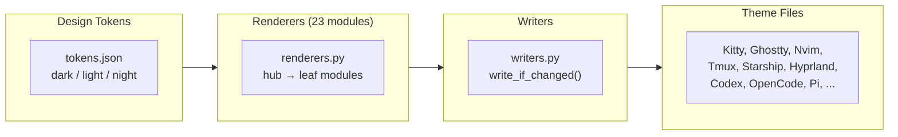

# Dreamcoder Workbench

> A health-first, terminal-native engineering environment built on **Gentleman.Dots + ML4W**.
> Cocoa/Lúcuma. Anthracite Steel. Healthy contrast. Identity.

Dreamcoder Workbench is a personal distribution layer for developers who live in the terminal: it adds token-governed themes (WCAG/APCA-validated), machine-specific ML4W keybinding profiles, AI-aware tooling, and a verification layer on top of Gentleman.Dots and ML4W — without replacing either upstream. It is built for people who want reproducible, health-conscious setups and are ready to keep configuration as code. The what/who/why is covered in the sections below; the docs index ([docs/README.md](docs/README.md)) is the entry point for everything else.

[](https://github.com/Dreamcoder08/Dreamcoder-Workbench/actions/workflows/theme-validation.yml)
[](https://github.com/Dreamcoder08/Dreamcoder-Workbench/actions/workflows/test-ml4w-setup.yml)
[](docs/DREAMCODER_DESIGN_SYSTEM.md#accessibility-policy)
[](docs/DREAMCODER_DESIGN_SYSTEM.md#accessibility-policy)
[](https://pypi.org/project/dreamcoder-theme/)
[](./LICENSE)

---

## Quick Start — 3-Step Install

Dreamcoder Workbench is a personal distribution layer that adds profiles, themes, generators, and verification around Gentleman.Dots and ML4W. It does not replace either upstream project.

### 1. Install Gentleman.Dots

```bash
brew install Gentleman-Programming/tap/gentleman-dots
gentleman-dots
```

→ Or download it from [Gentleman.Dots](https://github.com/Gentleman-Programming/Gentleman.Dots)

**Provides**: Neovim (29 plugins LazyVim), Ghostty shaders (53), Tmux/Zellij, Vim Trainer, Fish/Zsh/Nushell

### 2. Install ML4W OS

```bash
bash <(curl -s https://ml4w.com/os/stable)
```

→ [ML4W documentation](https://ml4w.com/os/)

**Provides**: full Hyprland (animations, keybinds, monitors), Waybar, Rofi, Dunst, GTK, Btop

### 3. Install Dreamcoder Workbench

```bash
git clone git@github.com:Dreamcoder08/Dreamcoder-Workbench.git ~/Documents/PROYECTOS/Dreamcoder-Workbench
cd ~/Documents/PROYECTOS/Dreamcoder-Workbench
./scripts/dreamcoder install
```

**Applies**: dark/light/night modes over the whole Gentleman + ML4W base

**Adds**: Starship prompt with AI session state, 19 shell functions, modern aliases, auto-theme switching

---

## ML4W Integration — Profile-Driven Keybinding System

Dreamcoder Workbench integrates with [ML4W](https://ml4w.com) through a modular, profile-driven system: machine-specific keybindings live in JSON profiles under `DreamcoderProfiles/dreamcoder/` and compile into `~/.config/hypr/custom.lua`, validated in CI.

- Profiles → generator → `custom.lua`; native `hl.dsp.*` dispatchers (hyprctl dispatch is broken on Hyprland 0.55+)
- Theme toggle: `SUPER + SHIFT + D`; blue light: `SUPER + SHIFT + U` / `I`

Full binding contract, dispatcher tables, file layout, and testing commands: [docs/configuration/ml4w.md](docs/configuration/ml4w.md)

---

## Why Dreamcoder Workbench?

| Feature               | Gentleman.Dots      | ML4W         | **Dreamcoder Workbench**        |
| --------------------- | ------------------- | ------------ | ------------------------------- |
| **Theme Engine**      | — Catppuccin        | ✓ Matugen    | ✓ **Token-based + WCAG/APCA**   |
| **Dark/Light/Night**  | —                   | ✓            | ✓ **+ night transition**        |
| **AI Session Prompt** | —                   | —            | ✓ **Session-aware prompt**      |
| **Accessibility**     | —                   | —            | ✓ **WCAG 4.5:1 + APCA 75**      |
| **Neovim**            | ✓ 29 plugins        | —            | ◐ Dreamcoder colorscheme        |
| **Hyprland**          | —                   | ✓ Full       | ◐ Color overlay                 |
| **Shell Configs**     | ✓ Fish/Zsh/Nushell  | ✓ Fish/Bash  | ◐ Aliases + functions           |
| **Ghostty Shaders**   | ✓ 53 GLSL           | —            | ◐ Uses Gentleman's shaders      |
| **Installer**         | ✓ Go TUI            | ✓ bash       | ✓ **Go TUI + Vim Trainer**      |
| **Prompt**            | — Basic             | — Basic      | ✓ **Starship 17 modules**       |

> ✓ = full support · ◐ = Dreamcoder Workbench adds an overlay · — = not provided

---

## What Dreamcoder Workbench does not replace

Dreamcoder Workbench is a **visual layer**, not a replacement. You keep everything Gentleman and ML4W already give you:

**Kept from Gentleman.Dots:**

- Neovim with 29 plugins (avante, copilot, blink, fzf-lua, oil, DAP...)
- Ghostty shaders (53 GLSL effects)
- Tmux/Zellij with TPM and plugins
- Vim Mastery Trainer
- Fish/Zsh/Nushell base config

**Kept from ML4W:**

- Full Hyprland (animations, keybinds, monitors, layouts)
- Waybar, Rofi, Dunst configs
- GTK 3.0/4.0 settings
- Matugen color generation pipeline
- Btop, Chromium/Edge configs

**Dreamcoder Workbench adds:**

- Color tokens validated with WCAG 4.5:1 + APCA
- 3 modes: Anthracite Steel (dark), Cocoa/Lúcuma (light), Night (low-light transition)
- Starship prompt with 17 modules and AI session state
- 19 shell functions (extract, sysupdate, killport, dots, cheat, http, logs, tm-session, tm, tmux-kill-all, identity, id-dev, id-founder, id-personal, id-research, dev-dots, sdd-swap, tl)
- Modern aliases with graceful fallback (eza, bat, fd, rg, zoxide)
- Auto-theme switching by schedule (systemd timer)
- Python library for theme generation (PyPI)

---

## Usage

### CLI

```bash
dreamcoder dark         # → Anthracite Steel OLED
dreamcoder light        # → Dreamcoder Light
dreamcoder status       # → System status overview
dreamcoder doctor       # → Health check
```

### Theme Engine (Python)

```bash
pip install dreamcoder-theme
dreamcoder-theme sync   # Render all themes
dreamcoder-theme doctor # Check health
```

---

## Architecture


```mermaid
flowchart LR
    subgraph Tokens["Design Tokens"]
        PT["tokens.json<br/>dark / light / night"]
    end
    subgraph Render["Renderers (23 modules)"]
        R["renderers.py<br/>hub → leaf modules"]
    end
    subgraph Write["Writers"]
        W["writers.py<br/>write_if_changed()"]
    end
    subgraph Output["Theme Files"]
        O["Kitty, Ghostty, Nvim,<br/>Tmux, Starship, Hyprland,<br/>Codex, OpenCode, Pi, ..."]
    end
    Tokens --> Render --> Write --> Output
```

---

## Philosophy

Dreamcoder Workbench is not a neon rice. It is a workbench:

- **Health first**: no pure black/white, strong contrast, low brightness
- **Daily comfort**: larger typography, calm prompt density, automatic day/night mode
- **Identity second**: Cocoa/Lúcuma warmth, diagnostic cyan, editorial colors

---

## Credits and upstream relationship

Dreamcoder Workbench builds on the upstream work of [Gentleman.Dots](https://github.com/Gentleman-Programming/Gentleman.Dots) and [ML4W](https://ml4w.com/). Their projects remain the source of the base environment; this repository contributes the Dreamcoder profiles, tokens, overlays, generators, and verification layer. See [docs/sources.md](docs/sources.md) for the repository-owned source manifest, pin mechanism, and ownership boundaries.

## Documentation

Work through the docs by task — pick what you want to do and start there. The full index lives in [docs/README.md](docs/README.md).

| Your task | Start here |
|-----------|------------|
| Understand the repo layout and upstream ownership | [Source Manifest](docs/sources.md) |
| Install or migrate from ML4W / Gentleman.Dots | [Installation guides](docs/README.md) |
| Configure a terminal, editor, shell, or multiplexer | [Configuration guides](docs/README.md) |
| Work with colors, tokens, or the theme engine | [Theme System](docs/configuration/theme-system.md) |
| Adjust ML4W keybindings and Hyprland integration | [ML4W integration](docs/configuration/ml4w.md) |
| Integrate with Claude Code / OpenCode / Pi | [AI Integration](docs/ai-integration.md) |
| Publish the Python package | [PyPI publishing](docs/pypi-publishing.md) |
| Contribute code or tests | [CONTRIBUTING.md](CONTRIBUTING.md) |

## Next steps

- [ ] Follow the [3-step install](#quick-start--3-step-install) and run `dreamcoder doctor` to verify the environment.
- [ ] Skim the [Source Manifest](docs/sources.md) to learn what the repo owns vs. upstream.
- [ ] Pick a component from the [Documentation](#documentation) table and read its guide.
- [ ] Report an issue or open a PR — see [CONTRIBUTING.md](CONTRIBUTING.md).

## Project

| Aspect        | Detail                             |
| ------------- | ---------------------------------- |
| **Status**    | Active                             |
| **Version**   | 1.0                                |
| **License**   | MIT                                |
| **Docs**      | [docs/README.md](docs/README.md)   |
| **Contribute**| [CONTRIBUTING.md](CONTRIBUTING.md) |

---

## SDD

This project uses Spec-Driven Development. Plans live in [docs/superpowers/plans/](docs/superpowers/plans/).
