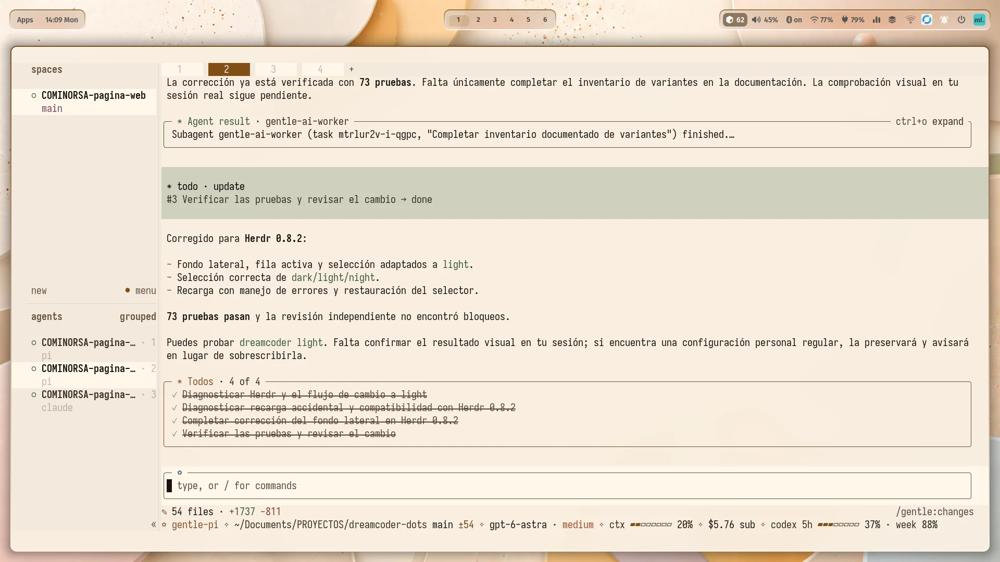

<!-- Reemplaza <PLACEHOLDERS> y borra las secciones que no apliquen -->

<div align="center">

# Dreamcoder Workbench

Terminal-native, health-first engineering environment built on Gentleman.Dots + ML4W.

[](./LICENSE)
[]()
[](https://pypi.org/project/dreamcoder-theme/)
[](docs/DREAMCODER_DESIGN_SYSTEM.md#accessibility-policy)

</div>

---

## Demo



## Índice

- [Descripción](#descripción)
- [Características](#características)
- [Stack técnico](#stack-técnico)
- [Instalación](#instalación)
- [Uso](#uso)
- [Estructura del proyecto](#estructura-del-proyecto)
- [Roadmap](#roadmap)
- [Licencia](#licencia)

## Descripción

Dreamcoder Workbench es una capa de distribución personal para desarrolladores que viven en la terminal: agrega temas gobernados por tokens (validados WCAG/APCA), perfiles de keybindings de ML4W por máquina, tooling AI-aware y una capa de verificación, todo sobre **Gentleman.Dots** y **ML4W** sin reemplazar a ninguno de los dos.

No es una app única sino un workbench/monorepo: combina un paquete Python (`dreamcoder-theme`) que genera y sincroniza temas, un instalador TUI en Go, y decenas de carpetas `Dreamcoder<Tool>/` con la configuración final de cada herramienta (Neovim, Ghostty, Kitty, Tmux, Zellij, Waybar, etc.).

## Características

- Motor de temas token-governed (`dreamcoder-theme`) con validación de contraste WCAG/APCA.
- Perfiles de keybindings ML4W específicos por máquina (desktop Arch, mobile Termux).
- Sincronización de configuraciones para 25+ herramientas de terminal/desktop (Neovim, Ghostty, Kitty, Warp, WezTerm, Waybar, Yazi, Lazygit, etc.).
- Integración AI-aware (Codex CLI/App, OpenCode, Pi, Herdr).
- Instalador TUI escrito en Go (Bubble Tea + Cobra) en `installer/`.
- Verificación/auditoría de configuración vía scripts (`scripts/verify-*.py`, `doctor.sh`).

## Stack técnico

| Capa | Tecnología |
|------|-----------|
| Motor de temas | Python 3.11+ (`dreamcoder-theme`, Jinja2) |
| Instalador TUI | Go 1.25 (Bubble Tea, Lipgloss, Cobra) |
| Automatización/sync | Shell (bash/zsh), shellcheck |
| Base de escritorio/terminal | Gentleman.Dots + ML4W (Hyprland, Neovim, Ghostty, Kitty, Waybar) |
| Tests | pytest (Python), Go e2e (`installer/e2e`) |
| Infraestructura | GoReleaser, Homebrew tap (`homebrew-tap/`) |

## Instalación

Dreamcoder Workbench se instala en 3 pasos, sobre Arch Linux (o derivada):

```bash
git clone https://github.com/Dreamcoder08/Dreamcoder-Workbench.git
cd Dreamcoder-Workbench
```

1. **Gentleman.Dots** (base de shells, terminales y Neovim):
   ```bash
   brew install Gentleman-Programming/tap/gentleman-dots
   gentleman-dots
   ```
2. **ML4W OS** (base de escritorio Hyprland):
   ```bash
   bash <(curl -s https://ml4w.com/os/stable)
   ```
3. **Dreamcoder Workbench** (temas, perfiles y verificación):
   ```bash
   pip install -e ".[dev]"
   ```

Guía completa paso a paso: [INSTALL.md](INSTALL.md).

### Variables de entorno

<TODO: completar> — no se encontró `.env.example` en el repo; no hay variables de entorno documentadas a nivel raíz.

## Uso

```bash
# generar/sincronizar el tema Dreamcoder
./scripts/dreamcoder sync

# correr tests del paquete Python
make test

# lint + type-check
make lint
```

## Estructura del proyecto

Monorepo/workbench con múltiples subproyectos, cada uno con su propia configuración:

```
Dreamcoder-Workbench/
├── src/dreamcoder_theme/   # paquete Python: motor de temas, renderers, CLI
├── installer/              # instalador TUI en Go (Bubble Tea + Cobra)
├── scripts/                 # sync, verificación, generación de paletas
├── tests/                   # tests pytest del paquete Python
├── docs/                    # arquitectura, ADRs, guías de instalación/migración
├── openspec/                # especificaciones del proyecto (SDD)
├── homebrew-tap/             # tap de Homebrew para el instalador
├── DreamcoderNvim/          # config final: Neovim
├── DreamcoderGhostty/       # config final: Ghostty
├── DreamcoderKitty/         # config final: Kitty
├── DreamcoderTmux/          # config final: Tmux
├── DreamcoderZellij/        # config final: Zellij
├── DreamcoderWaybar/        # config final: Waybar
├── DreamcoderShell/         # config final: Fish/Zsh/Bash/Starship
└── Dreamcoder<Tool>/        # config final para cada herramienta soportada (25+)
```

## Roadmap

<TODO: completar> — ver [CHANGELOG.md](CHANGELOG.md) para el historial de cambios; no se encontró un roadmap explícito en el repo.

## Licencia

Distribuido bajo licencia MIT. Ver [LICENSE](LICENSE) para más detalles.
