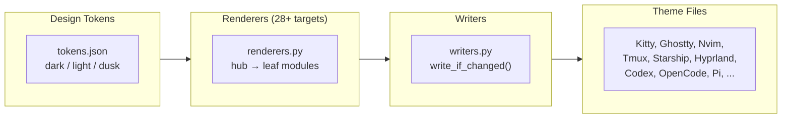

# Dreamcoder Workbench

> A health-first, terminal-native engineering environment built on **Gentleman.Dots + ML4W**.
> Café/Lúcuma. Anthracite Steel. Contraste saludable. Identidad.

Dreamcoder Workbench is a personal distribution layer for developers who live in the terminal: it adds token-governed themes (WCAG/APCA-validated), machine-specific ML4W keybinding profiles, AI-aware tooling, and a verification layer on top of Gentleman.Dots and ML4W — without replacing either upstream. It is built for people who want reproducible, health-conscious setups and are ready to keep configuration as code. The what/who/why is covered in the sections below; the docs index ([docs/README.md](docs/README.md)) is the entry point for everything else.

[](https://github.com/Dreamcoder08/Dreamcoder_dots/actions/workflows/theme-validation.yml)
[](https://github.com/Dreamcoder08/Dreamcoder_dots/actions/workflows/test-ml4w-setup.yml)
[](docs/DREAMCODER_DESIGN_SYSTEM.md#accessibility-policy)
[](docs/DREAMCODER_DESIGN_SYSTEM.md#accessibility-policy)
[](https://pypi.org/project/dreamcoder-theme/)
[](./LICENSE)

---

## Quick Start — 3-Step Install

Dreamcoder Workbench is a personal distribution layer that adds profiles, themes, generators, and verification around Gentleman.Dots and ML4W. It does not replace either upstream project.

### 1. Install Gentleman.Dots

```bash
brew install Gentleman-Programming/tap/gentleman-dots
gentleman-dots
```

→ O descargá desde [Gentleman.Dots](https://github.com/Gentleman-Programming/Gentleman.Dots)

**Te da**: Neovim (29 plugins LazyVim), Ghostty shaders (45+), Tmux/Zellij, Vim Trainer, Fish/Zsh/Nushell

### 2. Install ML4W OS

```bash
bash <(curl -s https://ml4w.com/os/stable)
```

→ [Documentación ML4W](https://ml4w.com/os/)

**Te da**: Hyprland completo (animaciones, keybinds, monitores), Waybar, Rofi, Dunst, GTK, Btop

### 3. Install Dreamcoder

```bash
git clone git@github.com:Dreamcoder08/Dreamcoder_dots.git ~/Documents/PROYECTOS/dreamcoder-dots
cd ~/Documents/PROYECTOS/dreamcoder-dots
./scripts/dreamcoder install
```

**Aplica**: Dreamcoder dark/light/dusk sobre toda la base de Gentleman + ML4W

**Agrega**: Starship prompt con AI session state, 9 funciones shell, aliases modernos, auto-theme-switching

---

## ML4W Integration — Profile-Driven Keybinding System

Dreamcoder integrates with [ML4W](https://ml4w.com) through a modular, profile-driven system: machine-specific keybindings live in JSON profiles under `DreamcoderProfiles/dreamcoder/` and compile into `~/.config/hypr/custom.lua`, validated in CI.

- Profiles → generator → `custom.lua`; native `hl.dsp.*` dispatchers (hyprctl dispatch is broken on Hyprland 0.55+)
- Theme toggle: `SUPER + SHIFT + D`; blue light: `SUPER + SHIFT + U` / `I`

Full binding contract, dispatcher tables, file layout, and testing commands: [docs/configuration/ml4w.md](docs/configuration/ml4w.md)

---

## ¿Por qué Dreamcoder?

| Feature               | Gentleman.Dots      | ML4W         | **dreamcoder-dots**            |
| --------------------- | ------------------- | ------------ | ------------------------------ |
| **Theme Engine**      | ❌ Catppuccin       | ✅ Matugen   | ✅ **Token-based + WCAG/APCA** |
| **Light/Dark/Dusk**   | ❌                  | ✅           | ✅ **+ Dusk transition**       |
| **AI Session Prompt** | ❌                  | ❌           | ✅ **Session-aware prompt**    |
| **Accesibilidad**     | ❌                  | ❌           | ✅ **WCAG 4.5:1 + APCA 75**    |
| **Neovim**            | ✅ 29 plugins       | ❌           | 🔶 Dreamcoder colorscheme      |
| **Hyprland**          | ❌                  | ✅ Completo  | 🔶 Color overlay               |
| **Shell Configs**     | ✅ Fish/Zsh/Nushell | ✅ Fish/Bash | 🔶 Aliases + functions         |
| **Ghostty Shaders**   | ✅ 45+ GLSL         | ❌           | 🔶 Usa los de Gentleman        |
| **Installer**         | ✅ Go TUI           | ✅ bash      | ✅ **Go TUI + Vim Trainer**    |
| **Prompt**            | ❌ Básico           | ❌ Básico    | ✅ **Starship 23 módulos**     |

> ✅ = lo tiene completo · 🔶 = dreamcoder aporta overlay · ❌ = no lo tiene

---

## Lo que dreamcoder NO reemplaza

Dreamcoder es una **capa visual**, no un reemplazo. Mantenés todo lo que ya te dan Gentleman y ML4W:

**De Gentleman.Dots se queda:**

- Neovim con 29 plugins (avante, copilot, blink, fzf-lua, oil, DAP...)
- Ghostty shaders (45+ GLSL effects)
- Tmux/Zellij con TPM y plugins
- Vim Mastery Trainer
- Fish/Zsh/Nushell base config

**De ML4W se queda:**

- Hyprland completo (animaciones, keybinds, monitores, layouts)
- Waybar, Rofi, Dunst configs
- GTK 3.0/4.0 settings
- Matugen color generation pipeline
- Btop, Chromium/Edge configs

**Dreamcoder aporta:**

- Tokens de color validados con WCAG 4.5:1 + APCA
- 3 modos: Anthracite Steel (dark), Cocoa/Lúcuma (light), Dusk (transición)
- Starship prompt con 23 módulos y AI session state
- 9 funciones shell (extract, sysupdate, killport, etc.)
- Aliases modernos con graceful fallback (eza, bat, fd, rg, zoxide)
- Auto-theme-switching por horario (systemd timer)
- Python library para generación de temas (PyPI)

---

## Uso

### CLI

```bash
dreamcoder dark         # → Anthracite Steel OLED
dreamcoder light        # → Dreamcoder Light
dreamcoder status       # → System status overview
dreamcoder doctor       # → Health check
```

### Theme Engine (Python)

```bash
pip install dreamcoder-theme
dreamcoder-theme sync   # Render all themes
dreamcoder-theme doctor # Check health
```

---

## Arquitectura


```mermaid
flowchart LR
    subgraph Tokens["Design Tokens"]
        PT["tokens.json<br/>dark / light / dusk"]
    end
    subgraph Render["Renderers (28+ targets)"]
        R["renderers.py<br/>hub → leaf modules"]
    end
    subgraph Write["Writers"]
        W["writers.py<br/>write_if_changed()"]
    end
    subgraph Output["Theme Files"]
        O["Kitty, Ghostty, Nvim,<br/>Tmux, Starship, Hyprland,<br/>Codex, OpenCode, Pi, ..."]
    end
    Tokens --> Render --> Write --> Output
```

---

## Filosofía

Dreamcoder no es un rice neon. Es un banco de trabajo:

- **Salud primero**: sin blanco/negro puro, contraste fuerte, bajo brillo
- **Confort diario**: tipografía más grande, densidad de prompt calmada, modo día/noche automático
- **Identidad segundo**: calidez Cocoa/Lúcuma, cyan diagnóstico, colores editoriales

---

## Credits and upstream relationship

Dreamcoder Workbench builds on the upstream work of [Gentleman.Dots](https://github.com/Gentleman-Programming/Gentleman.Dots) and [ML4W](https://ml4w.com/). Their projects remain the source of the base environment; this repository contributes the Dreamcoder profiles, tokens, overlays, generators, and verification layer. See [docs/sources.md](docs/sources.md) for the repository-owned source manifest, pin mechanism, and ownership boundaries.

## Documentation

Work through the docs by task — pick what you want to do and start there. The full index lives in [docs/README.md](docs/README.md).

| Your task | Start here |
|-----------|------------|
| Understand the repo layout and upstream ownership | [Source Manifest](docs/sources.md) |
| Install or migrate from ML4W / Gentleman.Dots | [Installation guides](docs/README.md) |
| Configure a terminal, editor, shell, or multiplexer | [Configuration guides](docs/README.md) |
| Work with colors, tokens, or the theme engine | [Theme System](docs/configuration/theme-system.md) |
| Adjust ML4W keybindings and Hyprland integration | [ML4W integration](docs/configuration/ml4w.md) |
| Integrate with Claude Code / OpenCode / Pi | [AI Integration](docs/ai-integration.md) |
| Publish the Python package | [PyPI publishing](docs/pypi-publishing.md) |
| Contribute code or tests | [CONTRIBUTING.md](CONTRIBUTING.md) |

## Next steps

- [ ] Follow the [3-step install](#quick-start--3-step-install) and run `dreamcoder doctor` to verify the environment.
- [ ] Skim the [Source Manifest](docs/sources.md) to learn what the repo owns vs. upstream.
- [ ] Pick a component from the [Documentation](#documentation) table and read its guide.
- [ ] Report an issue or open a PR — see [CONTRIBUTING.md](CONTRIBUTING.md).

## Projecto

| Aspecto        | Detalle                            |
| -------------- | ---------------------------------- |
| **Estado**     | Active                             |
| **Versión**    | 1.0                                |
| **Licencia**   | MIT                                |
| **Docs**       | [docs/README.md](docs/README.md)   |
| **Contribuir** | [CONTRIBUTING.md](CONTRIBUTING.md) |

---

## SDD

Este proyecto usa Spec-Driven Development. Los planes están en [docs/superpowers/plans/](docs/superpowers/plans/).
