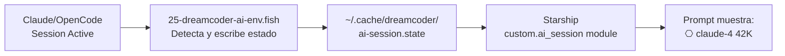

# Dreamcoder AI Integration

> Cómo dreamcoder se integra con Claude Code, OpenCode, Pi, y otras herramientas de IA.

## AI Session State en el Prompt

Dreamcoder tiene un módulo de Starship (`[custom.ai_session]`) que muestra el estado de tu sesión de IA actual en el prompt:

```
⎔ claude-4 42K
```

Esto se lee de `~/.cache/dreamcoder/ai-session.state`, que se actualiza automáticamente cuando:

- **Claude Code** tiene una sesión activa (`~/.claude/sessions/`)
- **OpenCode** está corriendo (`~/.opencode/state`)
- **Codex CLI** tiene contexto activo

### Cómo funciona



### Deshabilitar

```fish
set -gx DREAMCODER_AI_SESSION_DISABLED 1
```

---

## Pi Agent Theme

Dreamcoder genera un tema para Pi (el coding agent) que se escribe en:

- `~/.pi/agent/themes/dreamcoder.json`
- `~/.pi/agent/themes/dreamcoder-dark.json`
- `~/.pi/agent/themes/dreamcoder-light.json`

El tema se activa automáticamente via `ensure_pi_theme_settings()` que setea `theme: "dreamcoder"` en `~/.pi/agent/settings.json`.

### Mode Switching

Cuando cambiás de modo (`dreamcoder dark` / `dreamcoder light`), el tema de Pi se actualiza automáticamente:

```bash
dreamcoder dark   # Pi → dreamcoder-dark.json
dreamcoder light  # Pi → dreamcoder-light.json
```

---

## OpenCode Theme

Dreamcoder genera temas para OpenCode en:

- `~/.config/opencode/themes/dreamcoder.json`
- `.opencode/themes/dreamcoder.json` (repo copy)

El TUI de OpenCode usa el tema dreamcoder con fondo transparente para mejor integración visual.

---

## Codex CLI

Dreamcoder genera temas `.tmTheme` para Codex CLI:

- `~/.codex/themes/Dreamcoder.tmTheme`
- `~/.codex/themes/Dreamcoder-Dark.tmTheme`
- `~/.codex/themes/Dreamcoder-Light.tmTheme`

Y también temas `.codex-theme.json` para Codex App.

---

## CLAUDE.md

Dreamcoder incluye un `CLAUDE.md` con instrucciones para Claude Code sobre cómo trabajar con el repositorio. Cubre:

- Reglas de shell scripts (`set -euo pipefail`, quoting, `[[ ]]`)
- Modularidad (un archivo = un propósito)
- Safety (safe sourcing, sin hardcoded paths)

---

## Caso de Uso: Desarrollo con IA

1. Abrí Neovim (vía Gentleman.Dots) → 29 plugins, dreamcoder colorscheme
2. Iniciá Claude Code → `⎔ claude-4` aparece en el prompt
3. Escribí código con autocompletado (blink.cmp), fuzzy finder (fzf-lua), debugging (DAP)
4. Need a command? `cheat tar` → TLDR para tar
5. Need to extract something? `extract project.tar.gz`
6. Cambiando de tarea? `tm-session` → fzf session picker
7. Terminando el día? `sysupdate` → actualiza todo
8. El timer systemd cambia automáticamente a Anthracite Steel a las 18:00
