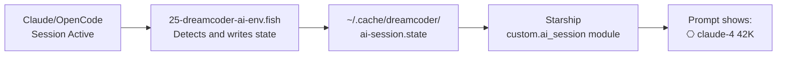

# Dreamcoder Workbench — AI Integration

← Back to [docs/README.md](README.md)

> How Dreamcoder Workbench integrates with Claude Code, OpenCode, Pi, and other AI tools.

Dreamcoder Workbench detects active AI sessions (Claude Code, OpenCode, Codex CLI) and reflects their
state in the Starship prompt, and it generates dedicated themes for coding agents.
This page covers session state in the prompt, per-agent themes, and an end-to-end use case.

## Quick path

1. Check the AI session state in the prompt: [AI Session State in the Prompt](#ai-session-state-in-the-prompt)
2. Configure the theme for the agent you use: [Pi](#pi-agent-theme), [OpenCode](#opencode-theme), [Codex CLI](#codex-cli)
3. Walk through the [use case](#use-case-ai-assisted-development) to see the full flow

---

## AI Session State in the Prompt

Dreamcoder Workbench ships a Starship module (`[custom.ai_session]`) that shows your current AI session state in the prompt:

```
⎔ claude-4 42K
```

It reads from `~/.cache/dreamcoder/ai-session.state`, which updates automatically when:

- **Claude Code** has an active session (`~/.claude/sessions/`)
- **OpenCode** is running (`~/.opencode/state`)
- **Codex CLI** has active context

### How it works



### Disabling

```fish
set -gx DREAMCODER_AI_SESSION_DISABLED 1
```

---

## Pi Agent Theme

Dreamcoder Workbench generates a theme for Pi (the coding agent), written to:

- `~/.pi/agent/themes/dreamcoder.json`
- `~/.pi/agent/themes/dreamcoder-dark.json`
- `~/.pi/agent/themes/dreamcoder-light.json`

The theme activates automatically via `ensure_pi_theme_settings()`, which sets `theme: "dreamcoder"` in `~/.pi/agent/settings.json`.

### Mode switching

When you switch modes (`dreamcoder dark` / `dreamcoder light`), the Pi theme updates automatically:

```bash
dreamcoder dark   # Pi → dreamcoder-dark.json
dreamcoder light  # Pi → dreamcoder-light.json
```

---

## OpenCode Theme

Dreamcoder Workbench generates themes for OpenCode at:

- `~/.config/opencode/themes/dreamcoder.json`
- `.opencode/themes/dreamcoder.json` (repo copy)

The OpenCode TUI uses the dreamcoder theme with a transparent background for better visual integration.

---

## Codex CLI

Dreamcoder Workbench generates `.tmTheme` files for Codex CLI:

- `~/.codex/themes/Dreamcoder.tmTheme`
- `~/.codex/themes/Dreamcoder-Dark.tmTheme`
- `~/.codex/themes/Dreamcoder-Light.tmTheme`

It also generates `.codex-theme.json` files for the Codex App.

---

## CLAUDE.md

Dreamcoder Workbench includes a `CLAUDE.md` with instructions for Claude Code on how to work with the repository. It covers:

- Shell script rules (`set -euo pipefail`, quoting, `[[ ]]`)
- Modularity (one file = one purpose)
- Safety (safe sourcing, no hardcoded paths)

---

## Use Case: AI-Assisted Development

- [ ] Open Neovim (via Gentleman.Dots) → 29 plugins, dreamcoder colorscheme
- [ ] Start Claude Code → `⎔ claude-4` appears in the prompt
- [ ] Write code with autocompletion (blink.cmp), fuzzy finder (fzf-lua), debugging (DAP)
- [ ] Need a command? `cheat tar` → TLDR for tar
- [ ] Need to extract something? `extract project.tar.gz`
- [ ] Switching tasks? `tm-session` → fzf session picker
- [ ] Ending the day? `sysupdate` → updates everything
- [ ] The systemd timer switches to Anthracite Steel automatically at 18:00
