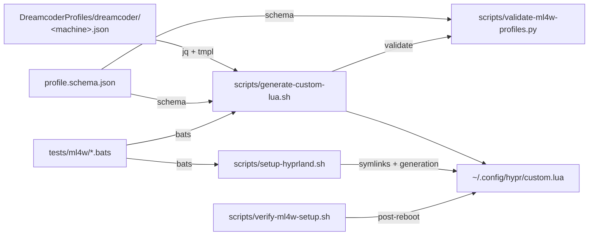

# ML4W Integration — Profile-Driven Keybinding System

← Back to [docs/README.md](../README.md)

Dreamcoder integrates with [ML4W](https://ml4w.com) through a modular, profile-driven system.
All machine-specific keybindings live in JSON profiles, avoiding manual editing of ML4W-managed files.
Profiles are compiled into `~/.config/hypr/custom.lua` by the generator and validated in CI.

## Architecture



## Workflow

1. **Edit profile**: `DreamcoderProfiles/dreamcoder/<machine>.json`
2. **Generate**: `./scripts/generate-custom-lua.sh --profile <machine>`
3. **Setup**: `./scripts/setup-hyprland.sh --profile <machine>`
4. **Verify (post-reboot)**: `./scripts/verify-ml4w-setup.sh`
5. **Validate (CI)**: `python3 scripts/validate-ml4w-profiles.py --ci`

## Profiles

| Profile           | Machine          | Keybindings                                     |
| ----------------- | ---------------- | ----------------------------------------------- |
| `default`         | Any generic      | Apps, workspaces, focus, theme, blue light      |
| `asus-vivobook15` | ASUS VivoBook 15 | Multimedia F row, brightness, backlight + all of the above |

Profile auto-detection reads **DMI hardware** (`/sys/class/dmi/id/product_name`,
`sys_vendor`) first, then falls back to the hostname. Hostname-only detection
was a bug: hosts named `archlinux` never matched `*asus*`, so the wrong profile
(with no multimedia or brightness binds) was generated silently.

## Binding contract (avoid duplicate binds)

`~/.config/hypr/conf/keybindings/dreamcoder.lua` (our curated ML4W variant) and
the generated `custom.lua` are BOTH loaded by `hyprland.lua`. They must not
define the same key — Hyprland executes ALL matching duplicate binds in
declaration order (e.g. `SUPER + F` fullscreens and immediately unfullscreens).

Per the official ML4W docs, shipped keybinding variations are overwritten on
updates, so custom bindings live in a separate **variant**. `conf/keybinding.lua`
(the selector) points at `dreamcoder.lua` instead of the stock `default.lua`.

- The **profile JSON owns** everything the generator can emit: apps, workspaces,
  focus/move, fullscreen/floating/split, screenshots, theme, hyprsunset, the
  multimedia F row and the keyboard backlight.
- The **`dreamcoder.lua` variant** is restricted to binds the generator
  **cannot** emit: native mouse drag/resize, workspace scroll, window swap,
  group toggle, scratchpad, ML4W actions (wallpaper, power, launcher,
  statusbar) and the XF86* multimedia keys as a hardware fallback.
- The stock `default.lua` stays untouched (defensive fallback if an ML4W
  update resets the selector; it is also curated to avoid duplicate binds).
- `setup-hyprland.sh` re-applies the selector + variant after ML4W updates.

If you add a keybinding, add it to the profile JSON and re-run the generator —
never to `dreamcoder.lua` unless it is a native-only bind.

## hyprctl dispatch is broken on Hyprland 0.55+ — native dispatchers used

Hyprland's Lua config parses `hyprctl dispatch <arg>` as Lua
(`hl.dispatch(<arg>)`), so legacy shell commands like
`hyprctl dispatch workspace 2` fail at runtime with a syntax error — the bind
appears registered but does nothing. `generate-custom-lua.sh` therefore
translates the following `hyprctl dispatch` commands in profiles to native
`hl.dsp.*` dispatchers:

| Shell command           | Native Lua dispatcher                                |
| ----------------------- | ---------------------------------------------------- |
| `hyprctl dispatch workspace N`     | `hl.dsp.focus({ workspace = N })`          |
| `hyprctl dispatch movetoworkspace N` | `hl.dsp.window.move({ workspace = N })`  |
| `hyprctl dispatch killactive`      | `hl.dsp.window.close()`                    |
| `hyprctl dispatch fullscreen 1`    | `hl.dsp.window.fullscreen({ mode = "fullscreen", action = "toggle" })` |
| `hyprctl dispatch togglefloating`  | `hl.dsp.window.float({ action = "toggle" })` |
| `hyprctl dispatch togglesplit`     | `hl.dsp.layout("togglesplit")`             |
| `hyprctl dispatch movefocus <dir>` | `hl.dsp.focus({ direction = "<dir>" })`    |
| `hyprctl dispatch movewindow <dir>`| `hl.dsp.window.move({ direction = "<dir>" })` |

Any other command still falls back to `hl.dsp.exec_cmd(...)`.

## What setup-hyprland.sh does

1. **Symlinks** wlogout + swaync `colors.css` → waybar (single theme toggle point)
2. **Generates** `custom.lua` from JSON profile via `generate-custom-lua.sh`
3. **Installs** toggle script (`dreamcoder-toggle-theme.sh`) to `~/.config/hypr/scripts/`
4. **Applies** ML4W hooks (wallpaper, theme regeneration)
5. **Reloads** Hyprland

## Theme Toggle

| Shortcut            | Action                             |
| ------------------- | ---------------------------------- |
| `SUPER + SHIFT + D` | Toggle Dreamcoder light/dark theme |
| `SUPER + SHIFT + U` | Activate blue light filter (4000K) |
| `SUPER + SHIFT + I` | Deactivate blue light filter       |

## Testing

```bash
# Run all ML4W integration tests
bats tests/ml4w/*.bats

# Validate all profiles against schema
python3 scripts/validate-ml4w-profiles.py --ci

# Dry-run without system changes
./scripts/setup-hyprland.sh --profile default --dry-run
./scripts/generate-custom-lua.sh --profile default --dry-run
```

## File Layout

```
scripts/
├── generate-custom-lua.sh    # JSON → custom.lua generator with --validate
├── setup-hyprland.sh         # Idempotent orchestrator (symlinks + generation + hooks)
├── verify-ml4w-setup.sh      # Post-reboot health verification
└── validate-ml4w-profiles.py  # Schema + convention validation with --ci flag

ml4w_assets/
└── hypr/
    ├── custom.lua.tmpl        # Lua template for keybinding generation
    └── scripts/
        └── dreamcoder-toggle-theme.sh  # Theme toggle script

DreamcoderProfiles/dreamcoder/
├── profile.schema.json        # JSON Schema for machine profiles
├── default.json               # Default profile (theme toggle + blue light)
└── asus-vivobook15.json       # ASUS VivoBook 15 profile (all Fn keys)

tests/ml4w/
├── generate_custom_lua.bats   # 13 tests for the generator
├── setup_hyprland.bats        # 9 tests for the orchestrator
├── profile_validation.bats    # 11 tests for JSON profiles
└── setup.bash                 # BATS test helper
```
