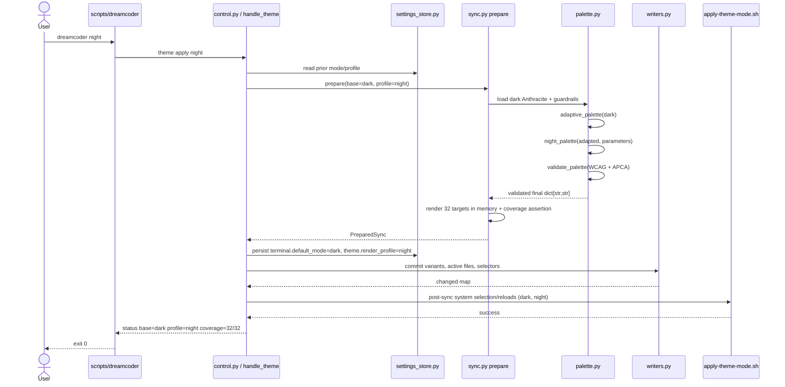
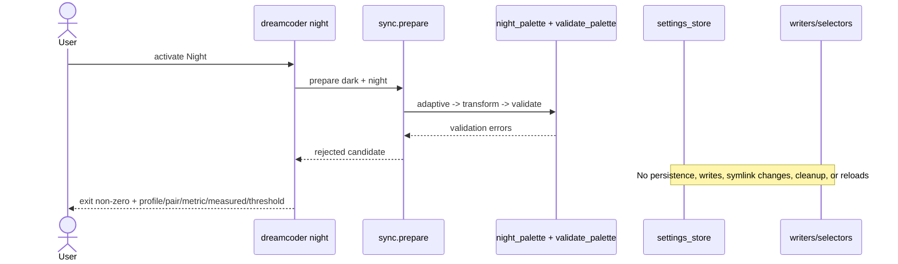
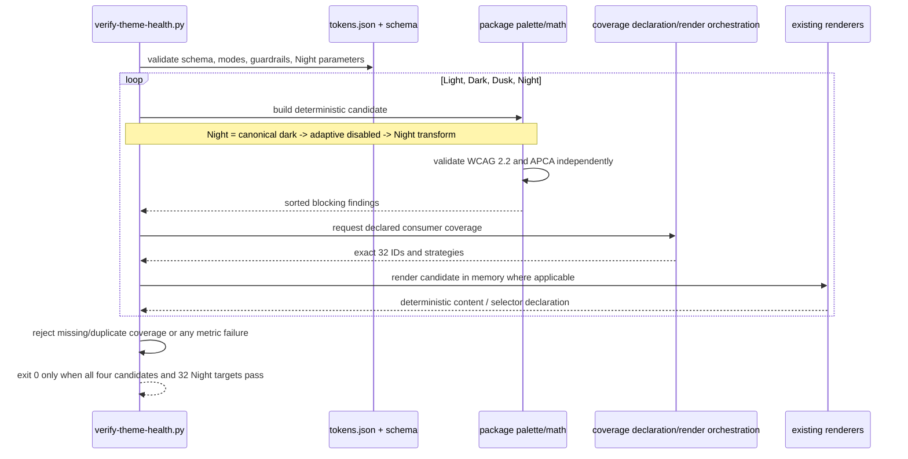

# Technical Design: Eye-Comfort Theme System

## Overview

This change adds Night/Dim as an orthogonal rendering profile around the existing Light/Dark base-mode engine. Night always resolves the dark Anthracite Steel base, applies wallpaper adaptation first, then applies one deterministic brightness/saturation transform, and validates the final palette with independent WCAG 2.2 and APCA gates before any renderer or writer is invoked. Dusk remains an in-memory design-system mode and is never activated at runtime.

The renderer boundary remains `dict[str, str] -> str`. The change is orchestration-first: `_math.py` owns contrast math, `palette.py` owns profile transformation and palette validation, `sync.py` owns profile resolution and the complete 32-target plan, and `writers.py` owns existing file/selector mutation semantics. Target renderers change only where a format embeds a profile name that cannot be supplied by orchestration (notably the Neovim dispatcher, Starship palette identity if separate sections are retained, Antigravity metadata, and Zellij's named theme artifact).

## Repository Findings That Shape the Design

- `sync_active_targets()` currently returns 36 status entries, but eight are selector/configuration housekeeping rather than color consumers: `kitty_config`, `ghostty_config`, `warp_settings`, `opencode_tui`, `opencode_cleanup`, `codex_config`, `pi_settings`, and `zellij`. Zellij is nevertheless an active theme consumer because the selector names a generated KDL theme; its Night KDL is the one required leaf addition. Grouping renderer-equivalent active/repository outputs by consumer, then adding repository-only Codex App, Antigravity, and Herdr, produces the scoped 32 consumers enumerated below. `README.md` is documentation, not a color consumer.
- `VARIANT_REGISTRY` has 21 entries and a two-key `D = {"dark": "dark", "light": "light"}` naming map. Five non-uniform families (Hyprland, Waybar, Rofi, Neovim, and transparent OpenCode) are handled after the registry loop; Herdr is a separate repository-only branch.
- Active paths are not uniformly variant paths. Some are stable files overwritten with the active palette (`paths.opencode`, `paths.starship`, `paths.tmux`); some are stable symlinks selected by `apply-theme-mode.sh`; Ghostty and Zellij select named themes; Neovim has a generated dispatcher.
- `write_if_changed()` writes directly and preserves a boolean changed/not-changed contract. Validation can prevent policy failures from causing partial writes, but an I/O failure after the first write can still leave a mixed state unless the activation layer snapshots and rolls back the target plan.
- `theme_mode()` reads only `DREAMCODER_THEME_MODE` and accepts only `light|dark`. Persistent settings currently contain `terminal.default_mode` but no render profile.
- `_math.py` has the WCAG functions but no APCA function. The SAPC/APCA 0.0.98G-4g constants and formula are duplicated in `verify-theme-health.py`, `generate-theme-preview.py`, and `test_dreamcoder_global_design_system.py`; `test_apca_implementation.py` currently extracts two of those duplicate formulas rather than importing the package.
- All required APCA floor keys already exist in `DreamcoderThemes/dreamcoder/tokens.json`: `minimum_apca_body`, `minimum_apca_body_dark`, `minimum_apca_quiet`, `minimum_apca_ui`, `minimum_apca_ui_dark`, `minimum_apca_on_accent`, `minimum_apca_heading_light`, and `minimum_apca_heading_dark`. The schema already defines all eight properties, but its `required` list omits the two heading keys.
- The current shell path performs system mode changes and symlink flips before Python sync. That ordering is incompatible with the requirement that a failed Night validation leave settings and active outputs unchanged.
- Several renderers call `detect_mode()` and correctly treat a transformed Night palette as dark because `details == "darker"`. They do not need a third mode branch. Profile naming/selection must therefore travel beside the palette, not inside its renderer shape.
- CodeGraph intelligence was unavailable in this executor runtime; repository findings above come from targeted reads of the authoritative files named by the change rather than broad filesystem inference.

## Goals and Boundaries

### In scope

- One canonical SAPC/APCA 0.0.98G-4g implementation in `_math.py`.
- Independent, blocking WCAG 2.2 and APCA validation using canonical guardrail values.
- A deterministic Night transform derived only from the adapted dark palette.
- Persistent `theme.render_profile = standard|night` with invocation-scoped environment override.
- Manual `dreamcoder night`; `dreamcoder light` and `dreamcoder dark` explicitly exit Night.
- Exact generation/selection coverage for the 32 consumers below.
- Fail-closed pre-write validation and rollback for activation-time write/reload failures.
- Light, Dark, Dusk, and Night health verification and package-imported math in scripts/tests.

### Out of scope

- Automatic sunset activation, scheduler changes, reminders, blue-light/warmth filters, or medical claims.
- A fourth hand-authored palette, Dusk runtime activation, or broad palette redesign.
- Renderer protocols, ports, classes, plugin discovery, or a new renderer input type.
- Screenshot/visual baselines.
- New application targets beyond the inventory below.

## Architecture

### 1. Canonical contrast core and dual gate

Add `apca_luminance()` as a private helper and `apca_lc(foreground, background) -> float` as the public canonical implementation in `src/dreamcoder_theme/_math.py`. Preserve the current constants, black soft clamp, normal/reverse polarity exponents, low-contrast clamp, scale, and offset from SAPC/APCA 0.0.98G-4g. `apca_lc()` returns signed polarity-aware Lc; threshold comparisons use `abs(lc)` while diagnostics retain the signed value and polarity.

### Audit (Phase 0.2): APCA guardrail keys and schema presence

Produced by PR1 task 0.2 against the current tree. All eight floor keys exist in `DreamcoderThemes/dreamcoder/tokens.json` `guardrails` and are defined as properties in `tokens.schema.json`; the schema `required` list omits the two heading keys (gap below).

| Guardrail key | tokens.json value | tokens.schema.json property | Schema `required` list |
| --- | ---: | --- | --- |
| `minimum_apca_body` | 75 | defined (line 36, min 60) | ✅ present |
| `minimum_apca_body_dark` | 50 | defined (line 37, min 45) | ✅ present |
| `minimum_apca_quiet` | 44 | defined (line 40, min 44) | ✅ present |
| `minimum_apca_ui` | 60 | defined (line 41, min 28) | ✅ present |
| `minimum_apca_ui_dark` | 28 | defined (line 42, min 28) | ✅ present |
| `minimum_apca_on_accent` | 60 | defined (line 43, min 60) | ✅ present |
| `minimum_apca_heading_light` | 60 | defined (line 38, min 45) | ❌ **gap** — absent |
| `minimum_apca_heading_dark` | 45 | defined (line 39, min 40) | ❌ **gap** — absent |

Gap recorded: the `guardrails.required` list must gain `minimum_apca_heading_light` and `minimum_apca_heading_dark` (task 1.8 adds them; both are already consumed at runtime by `verify-theme-health.py` `check_tokens()` via `.get()` with code-literal fallbacks that Phase 6 must remove).

`palette.py` re-exports `apca_lc()` alongside `contrast()`. `validate_palette(palette, guardrails, *, profile, mode)` becomes the package dual gate and returns stable diagnostics containing metric, profile/mode, foreground/background token names, measured value, and the guardrail key/value. It evaluates both metrics independently and accumulates both failures; neither result short-circuits or waives the other.

The APCA pair classes are declarative module metadata referencing guardrail keys, never numeric policy literals:

| Class | Token pairs | Light/Dusk threshold key | Dark/Night threshold key |
| --- | --- | --- | --- |
| Body | `text/bg`, semantic text uses (`error`, `warning`, `success`, `info`, `diagnostic`)/declared surface | `minimum_apca_body` | `minimum_apca_body_dark` |
| Heading | `text_heading/bg` | `minimum_apca_heading_light` | `minimum_apca_heading_dark` |
| Quiet | `muted/bg`, `comment/bg`, `subtle/bg`, `disabled/bg` where declared readable | `minimum_apca_quiet` | `minimum_apca_quiet` |
| UI | `border_ui/bg`, `border_hi/bg`, `focus/bg` | `minimum_apca_ui` | `minimum_apca_ui_dark` |
| On accent | `on_accent/accent` | `minimum_apca_on_accent` | `minimum_apca_on_accent` |

Existing WCAG checks remain independently blocking: `minimum_text_contrast`, `preferred_main_text_contrast`, terminal ANSI, cursor, and selection keys. Remove the duplicated literal `4.5` for on-color checks by resolving the canonical text floor (or a dedicated existing guardrail where already applicable).

### 2. Canonical Night profile contract and transformation

Add an author-owned profile section to `tokens.json`, separate from `modes`:

```json
"render_profiles": {
  "night": {
    "brightness_factor": 0.86,
    "saturation_factor": 0.72,
    "maximum_corrective_delta": 0.12,
    "corrective_step": 0.02
  }
}
```

These are initial canonical parameters, not renderer literals. `tokens.schema.json` requires `render_profiles.night` and bounds them as follows: brightness and saturation factors are numbers in `(0, 1]`; `maximum_corrective_delta` is `[0, 0.20]`; `corrective_step` is `(0, maximum_corrective_delta]`. The schema also adds the already-existing heading APCA keys to the guardrail `required` list. No new APCA threshold is added.

`night_palette(base, profile_parameters, guardrails) -> dict[str, str]` in `palette.py`:

1. Copies the adapted dark palette; input is never mutated.
2. Leaves semantic metadata (`name`, `details`) intact except setting the derived display name to `Dreamcoder Anthracite Steel Night`; `details` remains `darker`.
3. Converts every six-digit hex token to HSL, multiplies HSL lightness and saturation by the canonical factors, rounds RGB channels deterministically to nearest integer, and emits lowercase `#rrggbb`.
4. Parses `rgba(r,g,b,a)`, applies the same RGB transform, and preserves the alpha value exactly. Non-color metadata remains unchanged.
5. Re-establishes exact aliases such as `selection == selection_bg` when they were aliases in the input, preventing independent rounding drift.
6. Applies only a bounded corrective pass to declared foreground tokens that fail a gate. Each step moves foreground lightness toward the contrast-safe endpoint while preserving hue and the already-reduced saturation; total movement cannot exceed `maximum_corrective_delta`. Background/surface roles are not silently brightened, thresholds are never changed, and failure after the bound returns validation errors.
7. Rejects pure `#000000`/`#ffffff` when `avoid_pure_black_white` is true.

The transform is intentionally RGB/HSL deterministic rather than display-luminance calibrated; the feature is a rendering profile, not a hardware or medical claim. Identical tokens, wallpaper result, and profile parameters produce byte-identical palette dictionaries.

### 3. Settings and precedence

Extend `SETTINGS_SCHEMA` in `settings_store.py`:

```python
"theme.render_profile": {
    "type": "string",
    "enum": ["standard", "night"],
    "default": "standard",
    "description": "Theme rendering profile.",
}
```

Unknown settings continue to produce warnings and remain preserved. Invalid known profile values are rejected by `settings_set()` and by settings validation; the runtime resolver fails closed rather than interpreting an unknown value.

Add `render_profile()` to `settings.py` with this precedence:

1. `DREAMCODER_THEME_PROFILE` for the current process only; accepted values are `standard|night` and it never mutates settings.
2. Persisted `settings_get("theme.render_profile")`.
3. Schema default `standard` when absent.

`theme_mode()` keeps its existing responsibility and precedence (`DREAMCODER_THEME_MODE`, then its current default/activation input). Night is not accepted as a base mode. The effective-base resolver enforces `profile == night -> mode == dark`; a conflicting environment invocation such as `MODE=light, PROFILE=night` fails with an actionable error instead of choosing Dusk or silently coercing output. The user command itself deliberately writes dark base plus Night profile together.

### 4. Prepared sync plan and fail-closed ordering

Refactor orchestration without changing renderer signatures:

```text
load canonical variants + guardrails + profile parameters
  -> resolve base mode and render profile
  -> adaptive_palette(base)
  -> night_palette(...) when profile=night
  -> validate_palette(final)
  -> render all target contents in memory
  -> assert 32 coverage declarations
  -> snapshot settings and every mutable active path
  -> commit writes/selectors
  -> validate Starship and post-write selectors
  -> reload consumers
  -> status
```

`sync.py` should expose a preparation boundary used by CLI and health tests. It may use an internal immutable `PreparedSync`/`TargetWrite` structure, but that structure is orchestration state, not a renderer port. Every renderer still receives only `dict[str, str]`. Preparation performs no filesystem writes, including palette-token regeneration; generated fallback synchronization must run before activation or in explicit generation mode, not mutate during a validation-only preparation.

`main()` must call `validate_palette()` before `sync_active_targets()`, `sync_bat_theme_variants()`, or `sync_repo_snippets()`. For Night, build a render-variant map containing canonical `dark`, `light`, and derived `night`; Dusk stays health-only. The registry naming map becomes `{"dark": "dark", "light": "light", "night": "night"}`. Active stable files receive the already-derived `active` palette.

Preserve `write_if_changed(path, content) -> bool`. Activation snapshots all target files and selector files before the first mutation. On an exception, invalid post-write selector, reload failure designated blocking, or incomplete coverage result, restore those snapshots and the prior settings. This closes the I/O-failure gap while retaining per-file changed semantics. Repository generation outside activation may fail with explicit changed-path diagnostics; it must not be reported as successful Night activation.

### 5. Exact 32-target Night coverage inventory

Classification meanings:

- **variant file**: a named checked-in/runtime sibling is generated for Night.
- **active-selected**: a stable active file is rendered from Night or a selector points at a Night sibling.
- **snippet**: a repository color snippet/variant consumed through an include/source contract.

Selector/config housekeeping (`ensure_kitty_ui_include`, `write_opencode_tui`, cleanup, Codex/Pi settings) remains idempotent but is not counted as a color target. The following 32 rows are the implementation coverage contract derived from `sync_active_targets()`, `VARIANT_REGISTRY`, and the explicit branches in `sync_repo_snippets()`:

| # | Target | Current sync path(s) | Writer / renderer | Night artifact and selection strategy | Class |
| ---: | --- | --- | --- | --- | --- |
| 1 | Kitty colors | active `paths.kitty` (`$XDG_CONFIG_HOME/kitty/colors-dreamcoder.conf`); repo `DreamcoderKitty/.config/kitty/colors-dreamcoder-{dark,light}.conf` | `write_if_changed`; `write_variant_files`; `kitty_content` | Generate `DreamcoderKitty/.config/kitty/colors-dreamcoder-night.conf`; active symlink/file selects or receives Night. `ensure_kitty_ui_include` remains selector housekeeping. | variant file + active-selected |
| 2 | Kitty UI | active `paths.kitty_ui` (`$XDG_CONFIG_HOME/kitty/dreamcoder-ui.conf`); repo `DreamcoderKitty/.config/kitty/dreamcoder-ui-{dark,light}.conf` and stable `dreamcoder-ui.conf` | `write_if_changed`; `write_variant_files`; `kitty_ui_content` | Generate `dreamcoder-ui-night.conf`; stable include points to/contains Night. | variant file + active-selected |
| 3 | Ghostty | active `paths.ghostty` (`$XDG_CONFIG_HOME/ghostty/themes/dreamcoder`); repo `DreamcoderGhostty/.config/ghostty/themes/dreamcoder-{dark,light}` | `write_if_changed`; `write_variant_files`; `ghostty_content`; selector `update_ghostty_theme` | Generate `dreamcoder-night`; select `theme = dreamcoder-night`. Keep legacy light selector name `dreamcoder` only for standard light compatibility. | variant file + active-selected |
| 4 | Warp | active `paths.warp` (`$XDG_DATA_HOME/warp-terminal/themes/Dreamcoder.yaml`); repo `DreamcoderWarp/.local/share/warp-terminal/themes/Dreamcoder-{Dark,Light}.yaml`; settings `paths.warp_settings` | `write_if_changed`; `write_variant_files`; `warp_content`; `update_warp_settings` | Generate `Dreamcoder-Night.yaml`; active symlink/file selects it. Night uses dark opacity/blur semantics unless canonical profile-specific appearance parameters are later added. | variant file + active-selected |
| 5 | OpenCode theme | active `paths.opencode` (`$XDG_CONFIG_HOME/opencode/themes/dreamcoder.json`); repo `.opencode/themes/dreamcoder.json` | `write_if_changed`; `opencode_content(..., transparent_background=True)` | Stable theme ID remains `dreamcoder`; overwrite active/repo workflow output with transformed Night. `tui.json` still selects `dreamcoder`; no fake `dreamcoder-dark` fallback. | active-selected |
| 6 | Codex App JSON theme | repo `DreamcoderCodexApp/Dreamcoder-{Dark,Light}.codex-theme.json`; active `DreamcoderCodexApp/Dreamcoder.codex-theme.json` | `write_variant_files` + `write_if_changed`; `opencode_content` | Generate `Dreamcoder-Night.codex-theme.json`; stable `Dreamcoder.codex-theme.json` receives Night during Night repo sync. | variant file + active-selected |
| 7 | Codex CLI TextMate | active `paths.codex_theme` (`$CODEX_HOME/themes/Dreamcoder.tmTheme`); repo `DreamcoderCodexCLI/Dreamcoder-{Dark,Light}.tmTheme` and stable `Dreamcoder.tmTheme` | `write_if_changed`; `write_variant_files`; `codex_tmtheme_content` | Generate `Dreamcoder-Night.tmTheme`; stable configured `Dreamcoder` artifact receives Night. | variant file + active-selected |
| 8 | Bat TextMate theme | active `paths.bat_theme_dir/Dreamcoder.tmTheme`; repo `DreamcoderBat/.config/bat/themes/Dreamcoder-{Dark,Light}.tmTheme` and stable `Dreamcoder.tmTheme` | `sync_bat_theme_variants`; registry `write_variant_files`; `codex_tmtheme_content` | Generate `Dreamcoder-Night.tmTheme` in both active theme directory and repository; stable `Dreamcoder.tmTheme` receives Night. | variant file + active-selected |
| 9 | Pi CLI | active `paths.pi_theme` (`$PI_AGENT_DIR/themes/dreamcoder.json`); repo `DreamcoderPi/.pi/agent/themes/dreamcoder-{dark,light}.json` and stable `dreamcoder.json` | `write_if_changed`; `write_variant_files`; `pi_theme_content` | Generate `dreamcoder-night.json`; stable Pi theme remains `dreamcoder` and receives/selects Night. Update `pi-theme.sh` selector where it currently keys only on base mode. | variant file + active-selected |
| 10 | Antigravity | repo `DreamcoderAntigravity/Dreamcoder-{Dark,Light}.json` and stable `Dreamcoder.json` | `write_variant_files`; `write_if_changed`; `antigravity_content` | Generate `Dreamcoder-Night.json`; stable `Dreamcoder.json` receives Night. Renderer metadata must classify Night as dark without depending only on the word `Dark` in `name`. | variant file + active-selected |
| 11 | Starship | active `paths.starship` (`$STARSHIP_CONFIG`); repo `DreamcoderShell/.config/starship-{dark,light}.toml` | `write_if_changed`; `write_variant_files`; `starship_content` | Generate `starship-night.toml`; active config receives Night. Keep selected section `[palettes.dreamcoder]` for stable active files, or emit/select `[palettes.dreamcoder-night]` only in the named Night sibling; never leave a standard-dark palette section. | variant file + active-selected |
| 12 | tmux | active `paths.tmux` (`$XDG_CONFIG_HOME/tmux/tmux-dreamcoder.conf`); repo `DreamcoderThemes/dreamcoder/tmux-dreamcoder-{dark,light}.conf` | `write_if_changed`; `write_variant_files`; `tmux_content` | Generate `tmux-dreamcoder-night.conf`; active file receives Night. The Kanagawa bridge in `apply-theme-mode.sh` must use Night-derived values, not its current hardcoded dark literals. | variant file + active-selected |
| 13 | Zellij | selector `paths.zellij_config` (`$XDG_CONFIG_HOME/zellij/config.kdl`); existing repo themes `DreamcoderZellij/.config/zellij/dreamcoder-{dark,light}.kdl` | `update_zellij_config`; required minimal KDL leaf writer using transformed palette | Generate `DreamcoderZellij/.config/zellij/dreamcoder-night.kdl` containing `themes { dreamcoder-night { ... } }`; select `theme "dreamcoder-night"`. This is the one current selector whose consumed palette artifact is not generated by `sync.py`. | variant file + active-selected |
| 14 | Neovim | active dispatcher `paths.nvim` (`DreamcoderNvim/.config/nvim/colors/dreamcoder.lua` by default); repo variants `DreamcoderNvim/.config/nvim/colors/dreamcoder-{dark,light}.lua` | `write_if_changed`; `write_variant_files`; `nvim_dispatcher_content`; `nvim_content` | Generate `dreamcoder-night.lua`; dispatcher resolves `DREAMCODER_THEME_PROFILE` before base mode and loads Night explicitly. `vim.o.background=dark` without Night profile still selects standard dark. | variant file + active-selected |
| 15 | Zsh syntax | active `paths.zsh_syntax`; repo `DreamcoderThemes/dreamcoder/zsh-syntax-highlighting-dreamcoder-{dark,light}.zsh` | `write_if_changed`; `write_variant_files`; `zsh_syntax_content` | Generate `zsh-syntax-highlighting-dreamcoder-night.zsh`; active sourced file receives/selects Night. | snippet + active-selected |
| 16 | LS_COLORS/eza | active `paths.ls_colors`; repo `DreamcoderThemes/dreamcoder/ls-colors-dreamcoder-{dark,light}.sh` | `write_if_changed`; `write_variant_files`; `ls_colors_content` | Generate `ls-colors-dreamcoder-night.sh`; active sourced file receives/selects Night. | snippet + active-selected |
| 17 | Bat shell selector snippet | active `paths.bat`; repo `DreamcoderThemes/dreamcoder/bat-dreamcoder-{dark,light}.sh` | `write_if_changed`; `write_variant_files`; `bat_content` | Generate `bat-dreamcoder-night.sh`; it selects the Night TextMate sibling from row 8. | snippet + active-selected |
| 18 | Delta | active `paths.delta`; repo `DreamcoderThemes/dreamcoder/delta-dreamcoder-{dark,light}.gitconfig` | `write_if_changed`; `write_variant_files`; `delta_content` | Generate `delta-dreamcoder-night.gitconfig`; active include/symlink selects Night. | snippet + active-selected |
| 19 | fzf | active `paths.fzf`; repo `DreamcoderThemes/dreamcoder/fzf-dreamcoder-{dark,light}.sh` | `write_if_changed`; `write_variant_files`; `fzf_content` | Generate `fzf-dreamcoder-night.sh`; active sourced file receives/selects Night. | snippet + active-selected |
| 20 | btop | active `paths.btop`; repo `DreamcoderThemes/dreamcoder/btop-dreamcoder-{dark,light}.theme` | `write_if_changed`; `write_variant_files`; `btop_content` | Generate `btop-dreamcoder-night.theme`; active `dreamcoder.theme` symlink selects Night. | variant file + active-selected |
| 21 | Dunst | active `paths.dunst`; repo `DreamcoderThemes/dreamcoder/dunst-dreamcoder-{dark,light}.conf` | `write_if_changed`; `write_variant_files`; `dunst_content` | Generate `dunst-dreamcoder-night.conf`; active included file receives/selects Night. | snippet + active-selected |
| 22 | Firefox | active `paths.firefox`; repo `DreamcoderThemes/dreamcoder/firefox-dreamcoder-{dark,light}.css` | `write_if_changed`; `write_variant_files`; `firefox_content` | Generate `firefox-dreamcoder-night.css`; active userChrome import receives/selects Night; renderer continues dark CSS semantics. | snippet + active-selected |
| 23 | Obsidian | active `paths.obsidian`; repo `DreamcoderThemes/dreamcoder/obsidian-dreamcoder-{dark,light}.css` | `write_if_changed`; `write_variant_files`; `obsidian_content` | Generate `obsidian-dreamcoder-night.css`; active snippet receives/selects Night and keeps `.theme-dark`. | snippet + active-selected |
| 24 | Cava | active `paths.cava`; repo `DreamcoderThemes/dreamcoder/cava-dreamcoder-{dark,light}.config` | `write_if_changed`; `write_variant_files`; `cava_content` | Generate `cava-dreamcoder-night.config`; active include receives/selects Night. | snippet + active-selected |
| 25 | Hyprland main colors | active `paths.hyprland`; repo `DreamcoderThemes/dreamcoder/hyprland-{dark,light}.conf` plus stable `hyprland.conf` | `write_if_changed`; `hypr_content` | Generate `hyprland-night.conf`; stable `hyprland.conf` receives Night and shell selector may point to the Night sibling. | variant file + active-selected |
| 26 | Hyprland Lua colors | active `paths.hypr_colors_lua` (`$XDG_CONFIG_HOME/hypr/colors.lua`); repo `DreamcoderThemes/dreamcoder/hypr-colors-{dark,light}.lua` | `write_if_changed`; `write_variant_files`; `hypr_colors_lua_content` | Generate `hypr-colors-night.lua`; active symlink/file selects Night. | snippet + active-selected |
| 27 | Hyprland conf colors | active `paths.hypr_colors_conf` (`$XDG_CONFIG_HOME/hypr/colors.conf`); repo `DreamcoderThemes/dreamcoder/hypr-colors-{dark,light}.conf` | `write_if_changed`; `write_variant_files`; `hypr_colors_conf_content` | Generate `hypr-colors-night.conf`; active symlink/file selects Night. | snippet + active-selected |
| 28 | Waybar main CSS | active `paths.waybar`; repo `DreamcoderThemes/dreamcoder/waybar-{dark,light}.css` plus stable `waybar.css` | `write_if_changed`; `waybar_content` | Generate `waybar-night.css`; stable/selected Waybar CSS receives Night. | variant file + active-selected |
| 29 | Waybar Matugen bridge | active `paths.waybar_matugen` (`$XDG_CONFIG_HOME/waybar/colors.css`) | `write_if_changed`; `waybar_matugen_content` | Write transformed Night directly to `colors.css`; if it is a symlink, select `colors-night.css` before commit and include that path in rollback. | snippet + active-selected |
| 30 | Rofi main Rasi | active `paths.rofi`; repo `DreamcoderThemes/dreamcoder/rofi-{dark,light}.rasi` plus stable `rofi.rasi` | `write_if_changed`; `rofi_content` | Generate `rofi-night.rasi`; stable/selected Rofi theme receives Night. | variant file + active-selected |
| 31 | Rofi Matugen bridge | active `paths.rofi_matugen` (`$XDG_CONFIG_HOME/rofi/colors.rasi`) | `write_if_changed`; `rofi_matugen_content` | Write transformed Night directly to `colors.rasi`; if it is a symlink, select `colors-night.rasi` and snapshot the link target. | snippet + active-selected |
| 32 | Herdr repository profiles | `DreamcoderHerdr/.config/herdr/dreamcoder/<supported-version>/config.{dark,light}.toml` | `sync_herdr_repo_variants`; `write_if_changed`; `herdr_content(profile, mode, palette)` | Generate `config.night.toml` for every complete `SUPPORTED_PROFILES` entry. Extend Herdr's closed renderer mode only to accept `night` as dark semantics; remain repository-only with no live activation. | variant file |

`DreamcoderThemes/dreamcoder/README.md` must document the new suffixes but remains outside the count. `targets.json` adds `night` only to render coverage for these existing consumer identities; selector-only/excluded records, especially `dusk-runtime`, remain unchanged.

### Audit (Phase 0.1): Frozen 32-consumer mapping

Produced by PR1 task 0.1 against the current tree (`sync.py` at `15326a4`). This appendix freezes the mapping that reduces the 36 `sync_active_targets()` status entries plus repository-only consumers to the exact 32 IDs in the matrix above. Each row resolves to a real `sync.py` branch or `VARIANT_REGISTRY` entry, verified by reading the current source.

**Housekeeping entries excluded from the count** (7 of the 36 status entries — they select or manage palette identity but never carry palette bytes):

| Status entry | Sync call | Why excluded |
| --- | --- | --- |
| `kitty_config` | `ensure_kitty_ui_include(paths.kitty_config)` | appends a stable `include` line; no colors |
| `ghostty_config` | `update_ghostty_theme(paths.ghostty_config, mode)` | selector naming the generated Ghostty theme |
| `warp_settings` | `update_warp_settings(paths.warp_settings, mode)` | opacity/blur appearance, not colors |
| `opencode_tui` | `write_opencode_tui(paths.opencode_tui)` | stable `theme = "dreamcoder"` pointer |
| `opencode_cleanup` | `cleanup_opencode_themes(paths.opencode)` | removes non-canonical JSON siblings |
| `codex_config` | `ensure_codex_theme_config(paths.codex_config)` | stable `theme = "Dreamcoder"` pointer |
| `pi_settings` | `ensure_pi_theme_settings(paths.pi_settings)` | stable `theme = "dreamcoder"` pointer |

**Repo-only consumers added to reach 32** (3 — repository color artifacts with no live active path): `codex_app` (`VARIANT_REGISTRY` Codex App row, stable `DreamcoderCodexApp/Dreamcoder.codex-theme.json`), `antigravity` (`VARIANT_REGISTRY` Antigravity row, stable `DreamcoderAntigravity/Dreamcoder.json`), and `herdr` (`sync_herdr_repo_variants`, `config.{dark,light}.toml` per supported profile).

**Frozen mapping (29 active + 3 repo-only = 32):**

| # | Consumer ID | Current sync path(s) | Writer / renderer | Resolution |
| ---: | --- | --- | --- | --- |
| 1 | `kitty` | active `paths.kitty`; registry `DreamcoderKitty/.config/kitty/colors-dreamcoder-{dark,light}.conf` | `write_if_changed`; `write_variant_files`; `kitty_content` | `sync_active_targets()` + `VARIANT_REGISTRY` row 1 |
| 2 | `kitty_ui` | active `paths.kitty_ui`; registry `dreamcoder-ui-{dark,light}.conf`; explicit `dreamcoder-ui.conf` | `write_if_changed`; `write_variant_files`; `kitty_ui_content` | `sync_active_targets()` + `VARIANT_REGISTRY` row 2 + explicit snippet |
| 3 | `ghostty` | active `paths.ghostty`; registry `DreamcoderGhostty/.config/ghostty/themes/dreamcoder-{dark,light}` | `write_if_changed`; `write_variant_files`; `ghostty_content` | `sync_active_targets()` + `VARIANT_REGISTRY` row 3 |
| 4 | `warp` | active `paths.warp`; registry `DreamcoderWarp/.local/share/warp-terminal/themes/Dreamcoder-{Dark,Light}.yaml` | `write_if_changed`; `write_variant_files`; `warp_content` | `sync_active_targets()` + `VARIANT_REGISTRY` row 4 |
| 5 | `opencode` | active `paths.opencode`; explicit `.opencode/themes/dreamcoder.json` | `write_if_changed`; `opencode_content(transparent_background=True)` | `sync_active_targets()` + explicit snippet |
| 6 | `codex_app` | registry `DreamcoderCodexApp/Dreamcoder-{Dark,Light}.codex-theme.json` + stable `Dreamcoder.codex-theme.json` | `write_variant_files` + `write_if_changed`; `opencode_content` | `VARIANT_REGISTRY` row 6 (repo-only) |
| 7 | `codex_theme` | active `paths.codex_theme`; registry `DreamcoderCodexCLI/Dreamcoder-{Dark,Light}.tmTheme` + stable `Dreamcoder.tmTheme` | `write_if_changed`; `write_variant_files`; `codex_tmtheme_content` | `sync_active_targets()` + `VARIANT_REGISTRY` row 7 |
| 8 | `bat_theme` | active `paths.bat_theme_dir/Dreamcoder.tmTheme`; registry `DreamcoderBat/.config/bat/themes/Dreamcoder-{Dark,Light}.tmTheme` + stable `Dreamcoder.tmTheme` | `write_if_changed`; `write_variant_files`; `codex_tmtheme_content` | `sync_active_targets()` + `VARIANT_REGISTRY` row 8 + `sync_bat_theme_variants()` |
| 9 | `pi_theme` | active `paths.pi_theme`; registry `DreamcoderPi/.pi/agent/themes/dreamcoder-{dark,light}.json` + stable `dreamcoder.json` | `write_if_changed`; `write_variant_files`; `pi_theme_content` | `sync_active_targets()` + `VARIANT_REGISTRY` row 9 |
| 10 | `antigravity` | registry `DreamcoderAntigravity/Dreamcoder-{Dark,Light}.json` + stable `Dreamcoder.json` | `write_variant_files` + `write_if_changed`; `antigravity_content` | `VARIANT_REGISTRY` row 10 (repo-only) |
| 11 | `starship` | active `paths.starship`; registry `DreamcoderShell/.config/starship-{dark,light}.toml` | `write_if_changed`; `write_variant_files`; `starship_content` | `sync_active_targets()` + `VARIANT_REGISTRY` row 5 |
| 12 | `tmux` | active `paths.tmux`; registry `DreamcoderThemes/dreamcoder/tmux-dreamcoder-{dark,light}.conf` | `write_if_changed`; `write_variant_files`; `tmux_content` | `sync_active_targets()` + `VARIANT_REGISTRY` row 21 |
| 13 | `zellij` | selector `paths.zellij_config` | `update_zellij_config` | `sync_active_targets()`; kept as color consumer (selector names generated theme) |
| 14 | `nvim` | active dispatcher `paths.nvim`; registry `DreamcoderNvim/.config/nvim/colors/dreamcoder-{dark,light}.lua` | `write_if_changed`; `write_variant_files`; `nvim_dispatcher_content`; `nvim_content` | `sync_active_targets()` + explicit nvim variant block |
| 15 | `zsh_syntax` | active `paths.zsh_syntax`; registry `zsh-syntax-highlighting-dreamcoder-{dark,light}.zsh` | `write_if_changed`; `write_variant_files`; `zsh_syntax_content` | `sync_active_targets()` + `VARIANT_REGISTRY` row 11 |
| 16 | `ls_colors` | active `paths.ls_colors`; registry `ls-colors-dreamcoder-{dark,light}.sh` | `write_if_changed`; `write_variant_files`; `ls_colors_content` | `sync_active_targets()` + `VARIANT_REGISTRY` row 12 |
| 17 | `bat` | active `paths.bat`; registry `bat-dreamcoder-{dark,light}.sh` | `write_if_changed`; `write_variant_files`; `bat_content` | `sync_active_targets()` + `VARIANT_REGISTRY` row 13 |
| 18 | `delta` | active `paths.delta`; registry `delta-dreamcoder-{dark,light}.gitconfig` | `write_if_changed`; `write_variant_files`; `delta_content` | `sync_active_targets()` + `VARIANT_REGISTRY` row 14 |
| 19 | `fzf` | active `paths.fzf`; registry `fzf-dreamcoder-{dark,light}.sh` | `write_if_changed`; `write_variant_files`; `fzf_content` | `sync_active_targets()` + `VARIANT_REGISTRY` row 15 |
| 20 | `btop` | active `paths.btop`; registry `btop-dreamcoder-{dark,light}.theme` | `write_if_changed`; `write_variant_files`; `btop_content` | `sync_active_targets()` + `VARIANT_REGISTRY` row 16 |
| 21 | `dunst` | active `paths.dunst`; registry `dunst-dreamcoder-{dark,light}.conf` | `write_if_changed`; `write_variant_files`; `dunst_content` | `sync_active_targets()` + `VARIANT_REGISTRY` row 17 |
| 22 | `firefox` | active `paths.firefox`; registry `firefox-dreamcoder-{dark,light}.css` | `write_if_changed`; `write_variant_files`; `firefox_content` | `sync_active_targets()` + `VARIANT_REGISTRY` row 18 |
| 23 | `obsidian` | active `paths.obsidian`; registry `obsidian-dreamcoder-{dark,light}.css` | `write_if_changed`; `write_variant_files`; `obsidian_content` | `sync_active_targets()` + `VARIANT_REGISTRY` row 19 |
| 24 | `cava` | active `paths.cava`; registry `cava-dreamcoder-{dark,light}.config` | `write_if_changed`; `write_variant_files`; `cava_content` | `sync_active_targets()` + `VARIANT_REGISTRY` row 20 |
| 25 | `hyprland` | active `paths.hyprland`; explicit `hyprland-{dark,light}.conf` + stable `hyprland.conf` | `write_if_changed`; `hypr_content` | `sync_active_targets()` + explicit repo branches |
| 26 | `hypr_colors_lua` | active `paths.hypr_colors_lua`; explicit `hypr-colors-{dark,light}.lua` | `write_if_changed`; `write_variant_files`; `hypr_colors_lua_content` | `sync_active_targets()` + explicit repo `write_variant_files` |
| 27 | `hypr_colors_conf` | active `paths.hypr_colors_conf`; explicit `hypr-colors-{dark,light}.conf` | `write_if_changed`; `write_variant_files`; `hypr_colors_conf_content` | `sync_active_targets()` + explicit repo `write_variant_files` |
| 28 | `waybar` | active `paths.waybar`; explicit `waybar-{dark,light}.css` + stable `waybar.css` | `write_if_changed`; `waybar_content` | `sync_active_targets()` + explicit repo branches |
| 29 | `waybar_matugen` | active `paths.waybar_matugen` | `write_if_changed`; `waybar_matugen_content` | `sync_active_targets()` |
| 30 | `rofi` | active `paths.rofi`; explicit `rofi-{dark,light}.rasi` + stable `rofi.rasi` | `write_if_changed`; `rofi_content` | `sync_active_targets()` + explicit repo branches |
| 31 | `rofi_matugen` | active `paths.rofi_matugen` | `write_if_changed`; `rofi_matugen_content` | `sync_active_targets()` |
| 32 | `herdr` | repo `DreamcoderHerdr/.config/herdr/dreamcoder/<version>/config.{dark,light}.toml` | `sync_herdr_repo_variants`; `write_if_changed`; `herdr_content` | `sync_repo_snippets()` → `sync_herdr_repo_variants()` (repo-only) |

Count check: 29 active consumers (IDs 1–5, 7–9, 11–31) + 3 repo-only (IDs 6, 10, 32) = 32 unique IDs, no duplicates, each row resolving to a real `sync.py` branch or registry entry. This exactly matches the 32 matrix rows above; `README.md` is not a color consumer, and the 7 housekeeping entries are excluded by design.

### 6. Writer and selector extensions

| Function / selector | Current semantics | Minimal Night extension |
| --- | --- | --- |
| `write_if_changed(path, content)` | Direct write only when bytes differ; returns bool | Preserve signature and bool. Activation transaction snapshots path before call and restores it on failure; do not make it profile-aware. |
| `write_variant_files(base, names, builder, variants)` | Iterates `names` and indexes same mode key in `variants` | Accept the added `night` entry exactly like dark/light. Validate `names.keys() <= variants.keys()` before the first write. |
| `write_variant_files_and_active(...)` | Writes variants then stable active content | Keep behavior; use prepared/snapshotted writes so Night variants and active content are one activation transaction. |
| `update_ghostty_theme(path, mode)` | Light maps to legacy `dreamcoder`; dark maps to `dreamcoder-dark` | Pass effective profile or selector name; Night maps to `dreamcoder-night`, standard light retains `dreamcoder`, standard dark retains `dreamcoder-dark`. |
| `update_zellij_config(path, mode)` | Always writes `theme "dreamcoder-{mode}"` | Resolve selector from base/profile; Night writes `theme "dreamcoder-night"` only after its KDL exists in the prepared plan. |
| `update_warp_settings(path, mode)` | Dark uses opacity 76/blur 20; otherwise light 96/1 | Resolve appearance class from base/profile; Night uses dark behavior unless canonical Night appearance parameters are explicitly added. It must not enter the light branch. |
| `ensure_kitty_ui_include` | Adds stable UI include | No profile branch; the stable link/file is selected by activation. |
| `write_opencode_tui`, `ensure_codex_theme_config`, `ensure_pi_theme_settings` | Select stable theme IDs | No Night-specific IDs; stable IDs point at active Night bytes. |
| `cleanup_opencode_themes` | Deletes non-canonical JSON siblings | No `dreamcoder-night.json` sibling is introduced for OpenCode, avoiding cleanup conflict. |
| `valid_starship` | Validates active Starship file after write | Also run against prepared temporary/in-memory candidate before commit where possible; post-commit failure triggers rollback. |

Direct selectors in `scripts/apply-theme-mode.sh` must become profile-aware: Kitty, Waybar, Rofi, Hyprland, Pi, Warp, btop, Zellij, Delta, tmux environment, and the Kanagawa bridge select `night` artifacts while `DREAMCODER_THEME_MODE` remains `dark` and `DREAMCODER_THEME_PROFILE=night`. Light/Dark select their existing siblings and persist `standard`.

### 7. CLI activation and rollback transaction

Add a `theme` command to `cli_parser.py` with `theme apply {light,dark,night}` (and optional `--json`), a `handle_theme()` in `cli_handlers.py`, and registration in `control.py`. `scripts/dreamcoder` routes `light|dark|night` through this control path; generic `settings get/set theme.render_profile` continues unchanged.

The handler computes desired state:

| User choice | Base mode | Render profile |
| --- | --- | --- |
| `light` | `light` | `standard` |
| `dark` | `dark` | `standard` |
| `night` | `dark` | `night` |

It records prior base/profile and active target snapshots, asks sync to prepare and validate the complete candidate, then persists settings and commits. `scripts/apply-theme-mode.sh` becomes the bounded system/reload adapter and accepts both base mode and profile; it must not mutate symlinks or system mode until preparation has succeeded. On any blocking commit/reload failure the handler restores files, link targets, base/profile settings, and regenerates the prior profile before returning non-zero. The status payload reports requested choice, effective base, effective profile, 32/32 coverage, changed targets, and rollback state.



### 8. Failed validation path

Validation failure occurs before settings persistence, renderer writes, symlink changes, cleanup, system mode changes, or reloads. The CLI returns non-zero with all WCAG and APCA failures, including measured and required values.



### 9. Health verification and preview flow

`verify-theme-health.py` imports `contrast`, `apca_lc`, `night_palette`, `validate_palette`, and the coverage declaration from the installed package. Remove its local APCA constants/functions and `check_apca_or_warn()`. Declared pairs are all blocking. Load canonical guardrails without fallback policy literals.

The health command evaluates deterministic standard Light, standard Dark, Dusk, and Night. Wallpaper adaptation is disabled for the health gate; Night derives from canonical dark plus canonical profile parameters. For each candidate it runs package validation, then in-memory renderer generation. It compares the declared target IDs with the exact 32-entry sync coverage declaration and fails on missing, duplicate, or undeclared consumers. It does not write active files.

`generate-theme-preview.py` imports the same math and transform, adds Night tables, and remains text/HTML documentation generation only—no screenshots. `test_dreamcoder_global_design_system.py` imports package math and replaces advisory assertions with threshold assertions. `test_apca_implementation.py` imports `_math.apca_lc` directly and retains known-vector, polarity, clamp, and boundary evidence; AST extraction and cross-script-formula comparison are removed.



### 10. Planned file changes

- `DreamcoderThemes/dreamcoder/tokens.json`: add canonical `render_profiles.night` parameters; only narrowly correct existing colors if newly blocking validation proves necessary.
- `DreamcoderThemes/dreamcoder/tokens.schema.json`: schema/bounds for Night parameters; require existing heading APCA keys.
- `DreamcoderThemes/dreamcoder/targets.json` and `targets.schema.json`: declare Night coverage only for existing active consumer records; keep selector-only/excluded records unchanged.
- `src/dreamcoder_theme/palette_tokens.py`: regenerate through the existing generator if profile metadata/guardrails are represented there.
- `src/dreamcoder_theme/_math.py`: sole APCA implementation; update WCAG documentation language to 2.2 without changing ratio math.
- `src/dreamcoder_theme/palette.py`: re-export APCA, load guardrails/profile parameters, Night transform, dual validation diagnostics.
- `src/dreamcoder_theme/settings.py`, `settings_store.py`: profile setting/resolver and precedence.
- `src/dreamcoder_theme/sync.py`: prepared validation-first flow, Night registry names, exact 32-entry coverage declaration, repository Night branches, rollback inputs.
- `src/dreamcoder_theme/writers.py`: variant key preflight and profile-aware selectors while preserving renderer and `write_if_changed` contracts.
- `src/dreamcoder_theme/cli_parser.py`, `cli_handlers.py`, `control.py`: `theme apply` activation transaction and status.
- `scripts/dreamcoder`, `scripts/apply-theme-mode.sh`: Night route, profile-aware selectors, post-validation mutation ordering, Light/Dark profile exit.
- `scripts/verify-theme-health.py`, `scripts/generate-theme-preview.py`: import package math/transform; four-candidate validation and 32-target coverage.
- Minimal renderer leaf changes only where named-profile metadata/selection requires them: Neovim dispatcher, Antigravity type detection, Starship naming if needed, Zellij KDL generation, Herdr mode acceptance. Other renderers consume transformed dictionaries unchanged.
- Focused tests in existing palette, sync, writers, settings, CLI, health, APCA, and global-design-system test modules; add a target-coverage test if no current module is suitable.
- `docs/DREAMCODER_DESIGN_SYSTEM.md` and generated preview documentation: independent blocking policy, Night scope, non-medical boundaries, suffix inventory.
- Generated Night artifacts listed in the matrix, only through supported generation.

## Test Strategy

### Unit tests

- APCA known vectors, signed polarity, black soft clamp, low-contrast clamp, exact boundary and just-below-boundary behavior.
- Guardrail lookup proves all APCA/WCAG thresholds originate in loaded canonical tokens; missing required guardrails fail.
- Night transform key parity, alias parity, RGBA alpha preservation, no pure black/white, deterministic bytes, parameter bounds, and maximum corrective movement.
- Both-metric accumulation: WCAG-pass/APCA-fail and APCA-pass/WCAG-fail.
- Settings schema, unknown-setting preservation, default profile, persisted resolution, environment precedence/non-mutation, invalid and conflicting mode/profile failures.
- Writer naming for every Night registry entry; Ghostty, Zellij, Warp, Neovim, Pi, and shell selector behavior.
- Coverage declaration is exactly 32 unique IDs and remains in bijection with the matrix/registry/explicit sync branches.

### Integration tests

- `dreamcoder night` prepares, validates, persists dark+night, writes/selects all 32, and reports `32/32`.
- `dreamcoder light` and `dreamcoder dark` from Night persist `standard` and regenerate all active outputs.
- Forced Night APCA and WCAG failures invoke no writer, selector, cleanup, system-mode command, or reload and leave settings unchanged.
- Injected write/reload failure after a partial commit restores file bytes, symlink targets, and settings.
- Repository generation creates every exact `*-night`/`Night` artifact in the matrix and never creates Dusk runtime files.
- Starship candidate validates before commit; OpenCode cleanup keeps the stable canonical file; Herdr emits `config.night.toml` only for complete supported profiles.

### Health and regression tests

- `PYTHONPATH=src python scripts/verify-theme-health.py` validates Light, Dark, Dusk, Night and all 32 declarations with stable diagnostics and non-zero on any below-floor pair.
- A removed coverage row, duplicate ID, standard-dark substitution, or missing Night artifact fails with target and strategy.
- `generate-theme-preview.py` and health decisions match package math; no duplicate APCA constants/formula occur in the three former locations.
- `python -m pytest tests/ -v`, Ruff, mypy, and ShellCheck cover the touched layers. No screenshot baseline is introduced.

## Rollout and Migration

1. Land canonical APCA math, package imports, schemas, and focused vector/guardrail tests without changing activation.
2. Add Night transform and validate all four deterministic candidates. Resolve existing advisory debt only through narrow documented token corrections; do not lower thresholds.
3. Add the explicit 32-target coverage declaration and Night repository generation. Generate/review all named artifacts before exposing the CLI.
4. Add settings and profile-aware selectors, then move shell mutations behind preparation.
5. Enable `dreamcoder night` and Light/Dark exit behavior with transaction/rollback tests.
6. Make health coverage and all declared APCA pairs blocking locally and in CI; update documentation and preview output.

Rollback removes Night CLI/settings/variants/selectors and regenerates standard Light/Dark artifacts through the supported workflow. Canonical APCA math and healthy dual-gate diagnostics remain. `dreamcoder dark` is the operator recovery path; rollback verification runs health plus focused selector/coverage tests before reporting success.

## Risks and Mitigations

- **The current 32-target count is implicit.** Freeze the exact IDs above in one package coverage declaration and test its bijection with sync branches; do not derive scope from the 37-record manifest.
- **Zellij currently selects colors that sync does not generate.** Add only the minimal KDL renderer/artifact needed for Night and include its existing dark/light files in parity tests; do not generalize renderer ports.
- **Shell pre-mutation can violate fail-closed behavior.** Require preparation success before settings, symlinks, system mode, cleanup, or reload mutation, and snapshot the full commit set.
- **Sequential filesystem failures can still produce partial state.** Use activation-level snapshot/rollback around existing writers and verify restored link targets and bytes.
- **Dimming may break readability.** Bound canonical parameters and corrective movement, validate the final palette with both gates, and fail rather than substitute standard dark.
- **Existing advisory APCA debt may block rollout.** Inventory failures by pair and usage; permit only narrow canonical corrections, never threshold literals or waivers.

### Audit (Phase 0.3): Blocking-debt register from the current advisory path

Produced by PR1 task 0.3: `PYTHONPATH=src python scripts/verify-theme-health.py` (exit 0 today — every below-floor pair is advisory through `check_apca_or_warn()`, never blocking). The register below is the exact set of pairs that reach `check_apca_or_warn()` at the three call sites (lines 377, 382, 430) and must be resolved by the Phase 2 narrow token corrections and Phase 6 blocking health.

| # | Mode | Pair (fg/bg) | Class | Measured Lc | Threshold key | Threshold | WCAG ratio (passes) | Call site |
| ---: | --- | --- | --- | ---: | --- | ---: | --- | --- |
| 1 | dark | `subtle` / `bg` (`#708090` / `#070A13`) | Quiet | 33.7 | `minimum_apca_quiet` | 44 | 4.88:1 | `check_apca_or_warn` (line 382) |
| 2 | dark | `border_ui` / `bg` (`#526575` / `#070A13`) | UI | 21.5 | `minimum_apca_ui_dark` | 28 | 3.27:1 | `check_apca_or_warn` (line 430) |

Extended class-floor debt (pairs that are NOT reached by the current advisory path because `check_apca_or_warn()` only visits accent/quiet/UI keys, but that the design §1 class floors would flag once `validate_palette()`/health enforce the full matrix): `dark:disabled` (`#708090` on `#070A13`, Lc 33.7 < quiet 44 — alias of `subtle` today), `light:success` (`#3d723d` on `#f3eadc`, Lc 66.6 < body 75), and `dusk:success` (`#466b41` on `#ebe4d6`, Lc 64.8 < body 75). These three are recorded for Phase 2/6 planning; they are not emitted by the current command.

Note: the advisory thresholds reach the call sites through `guardrails.get(key, <literal>)` fallbacks in `check_tokens()`. The effective values above come from `tokens.json` (keys exist), but the fallback literals are code literals that Phase 6 (task 6.1) must delete when health imports the canonical guardrails directly.

- **Profile/base ambiguity can leak standard dark.** Carry profile separately from mode, reject conflicts, and assert artifact content hashes differ from standard dark where the transform changes tokens.
- **Renderer metadata can misclassify Night.** Fix only consumers that infer identity from names; ordinary `detect_mode(details)` consumers already receive dark semantics.

## Architecture Decision Records

### ADR-001: APCA lives in `_math.py` as the sole implementation

**Decision:** `src/dreamcoder_theme/_math.py::apca_lc()` is the only SAPC/APCA formula. Scripts and tests import it.

**Rationale:** One pure stdlib implementation prevents constant/polarity drift and lets package validation, health, preview, and tests produce identical values. Known-vector tests validate the implementation rather than comparing duplicate formulas.

**Consequences:** `_math.py` owns APCA constants and clamp semantics; duplicate-formula detection becomes a regression check. Consumers must arrange `PYTHONPATH`/package installation correctly.

### ADR-002: WCAG 2.2 and APCA are independent blocking gates

**Decision:** Every declared pair must pass both applicable metrics. Thresholds are read from `tokens.json.guardrails` by key; no policy threshold is embedded in Python, shell, tests, or documentation.

**Rationale:** WCAG remains the accessibility floor while APCA adds polarity/perceptual evidence useful for low-luminance interfaces. Compensation between metrics would hide a real failure and reintroduce policy drift.

**Consequences:** Existing advisory cases can block implementation and may require narrow token corrections. Diagnostics must identify metric, pair, measured value, threshold key/value, mode, and profile.

Correction note (PR1 review R1): the gate applies both metrics to **every** declared APCA-class pair — an APCA-boosted near-invisible pair (e.g. ~1:1 WCAG contrast boosted to Lc 44+) cannot pass unremarked, and a missing declared pair token is reported instead of silently skipped. The caller-supplied `mode` is validated (closed set `light|dark|dusk`; `dusk` uses the light floors). This surfaces pre-existing token debt for Phase 2 corrections: dark `border_ui` (WCAG 3.27) and light `disabled` (WCAG 4.10) now fail the dual gate on canonical palettes.

### ADR-003: Night is an orthogonal derived profile with one dark base

**Decision:** Night is `base_mode=dark` plus `render_profile=night`, never a fourth hand-authored palette and never Dusk. It derives deterministically after adaptation, validates before rendering/writing, and fails closed without partial activation or standard-dark fallback.

**Rationale:** This preserves Anthracite Steel identity and semantic roles while avoiding duplicated palette maintenance and runtime ambiguity. Keeping base and profile separate lets Light/Dark behavior remain backward compatible.

**Consequences:** Selectors need a Night artifact name while renderers continue to see dark-shaped palette data. Light/Dark commands explicitly persist `standard`. Automatic scheduling remains unchanged.

### ADR-004: Renderer ports are deferred; existing dictionary shape is preserved

**Decision:** Existing renderers continue as callables accepting `dict[str, str]` and returning strings. Internal prepared-write/coverage structures belong only to orchestration. Leaf renderer changes are allowed solely when a target format embeds a Night name or otherwise cannot consume transformed colors.

**Rationale:** A renderer-interface migration is unrelated architectural work and would enlarge risk across 32 consumers. The current shape already carries every transformed semantic token.

**Consequences:** Some registry and explicit branches remain heterogeneous. Their completeness is controlled through the explicit coverage declaration and tests rather than a new plugin/port abstraction.
