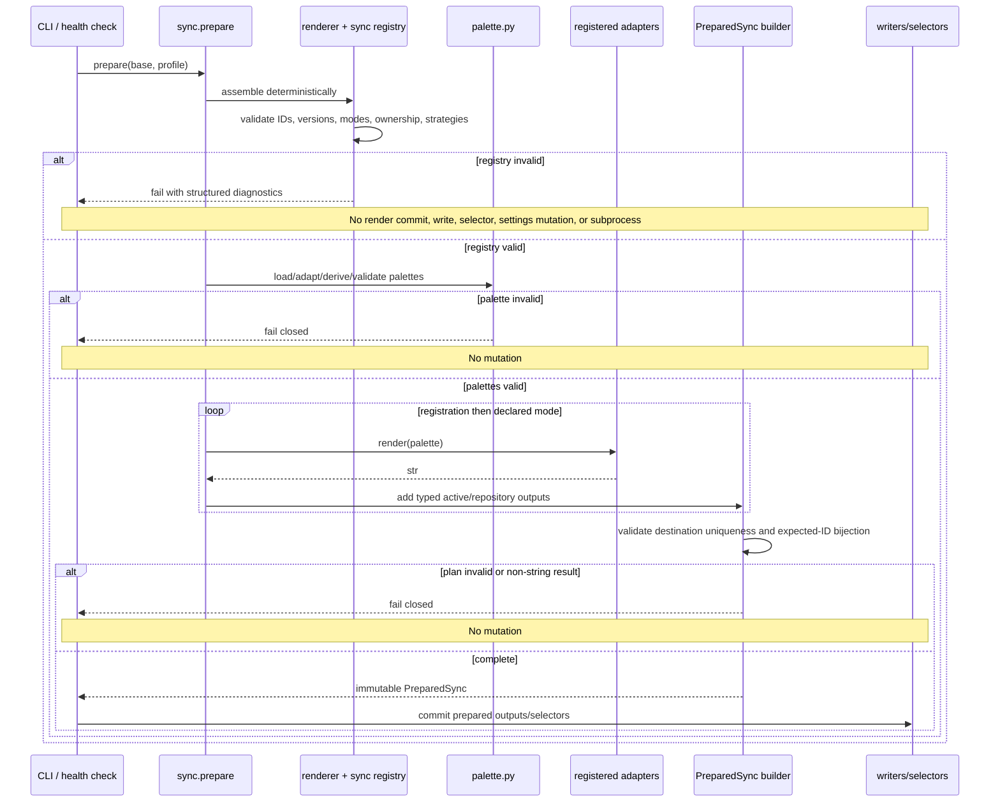
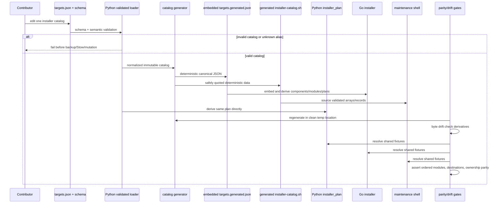

# Technical Design: Hexagonal Architecture V2

## Overview

This change replaces two independent forms of change amplification with validated, declarative contracts:

1. The Python theme engine gains one structural renderer port and one immutable registration per active consumer. A typed sync registry built from those registrations becomes the only source for paths, modes, variants, coverage, write planning, and summary rows.
2. `DreamcoderThemes/dreamcoder/targets.json` gains a canonical installer catalog. Python reads it directly; a deterministic generator produces a normalized JSON artifact embedded by Go and safely quoted shell data. CI proves both derivatives are byte-current with the authored manifest.

The design preserves the existing `dict[str, str] -> str` leaf-renderer shape, the 32 active consumer identities, Light/Dark/Night bytes, `PreparedSync`, validation-before-write, `write_if_changed()`, selectors, conflict backup, and GNU Stow behavior. It does not merge the 37-record rollout inventory, the 32-consumer renderer registry, and the 18-component installer catalog: the manifest expresses their relationships explicitly.

## Repository Findings That Shape the Design

- `src/dreamcoder_theme/renderers.py` is a flat import/export hub. Leaf functions are structurally compatible in the common case, but `sync.py` binds exceptions manually: transparent OpenCode, the palette-free Nvim dispatcher, named Zellij output, and version/mode-bound Herdr.
- `src/dreamcoder_theme/sync.py` repeats target identity across `sync_active_targets()`, `COVERAGE`, `VARIANT_REGISTRY`, `render_coverage_plan()`, `sync_repo_snippets()`, and `print_summary()`. `validate_coverage_declaration()` also hard-codes `32`, `10` explicit branches, and one Herdr row.
- Current `COVERAGE` contains exactly the 32 IDs frozen in §5. Twenty-one are represented by the current `VARIANT_REGISTRY`, ten by explicit branches, and Herdr by a separate branch. This source classification is an implementation detail to remove, not a contract to retain.
- `ThemePaths` mixes registered output paths with selector/config housekeeping, token and wallpaper inputs, and Herdr temporary/state paths. Herdr state belongs to its adapter; tokens and wallpaper are sync inputs; selector paths belong to selector strategies.
- `prepare()` already creates an immutable `PreparedSync` and renders the full coverage plan before mutation. The new registry must strengthen this boundary rather than move writes into discovery or conformance checks.
- `DreamcoderThemes/dreamcoder/targets.json` is a 37-record rollout manifest. Its current `install` blocks are rollout placeholders such as `$XDG_CONFIG_HOME/dreamcoder/<id>` and kebab-style module strings; they are not equivalent to the actual Go, shell, or Python installer inventories.
- Go currently authors 20 component-name mappings, including compatibility selections `KittyTheme` and `NvimTheme`, while `KnownComponents()` exposes 18 selectable components. Fish, Zsh, and Bash all resolve to `DreamcoderShell`.
- Shell currently authors seven short module tokens (`Shell`, `Kitty`, `Ghostty`, `Fastfetch`, `Warp`, `Bat`, `Systemd`) and eight backup destinations. The short tokens do not match the case-sensitive repository module directories used by Go/Python.
- Python currently authors 13 destination rows and emits seven canonical modules. It contains a concrete mismatch: the timer row says module `Systemd`, while the emitted module list uses `DreamcoderSystemd`.
- Go correctly names `DreamcoderBat` and `DreamcoderAntigravity`; the rollout manifest currently says `Dreamcoder-bat` and `Dreamcoder-antigravity`. Canonical Stow module names therefore cannot be derived by casing an ID.
- CodeGraph was unavailable to this executor (the checkout has no readable `.codegraph` index and the phase runtime exposes no initialization/CLI tool). Findings therefore use targeted reads of the authoritative files named by the change rather than broad structural inference.

## Goals and Boundaries

### In scope

- One versioned `Renderer` `Protocol` with semantic signature `dict[str, str] -> str`.
- Immutable, deterministic registrations for the exact 32 active consumers.
- One typed sync registry deriving render plans, path ownership, variants, coverage, writes, selectors, and summaries.
- `ThemePaths` removal or temporary read-only compatibility facade generated from registry path resolvers.
- A canonical 18-component installer catalog in `targets.json`, including exact modules, aliases, destinations, ownership, categories, and default selection.
- Deterministic, drift-checked Go and shell derivatives.
- Metadata-only legacy-name migration with fail-closed preflight and idempotent canonical restow.
- Cross-language conformance, bijection, parity, migration, and drift tests.

### Out of scope

- Refactoring shell god-scripts or replacing the existing shell library/control flow.
- Visual baselines or screenshot governance (SDD 3).
- Palette/token redesign, output-format changes, or weaker WCAG/APCA gates.
- Motion, scheduling, Dusk runtime activation, or new targets/components.
- Top-level module-directory renames.
- Resuming the archived July architecture refactor.

## Architecture

### 1. Renderer port and immutable registration model

Add `src/dreamcoder_theme/renderer_contract.py`:

```python
from collections.abc import Mapping
from typing import Protocol

Palette = dict[str, str]

class Renderer(Protocol):
    def __call__(self, palette: Palette, /) -> str: ...
```

The callable protocol is the single renderer port. `Mapping[str, str]` may be used inside adapters and validators, but registrations expose a callable that remains compatible with existing `dict[str, str] -> str` leaf functions. A stateful adapter may inherit an internal ABC for lifecycle/shared implementation, but that ABC must implement the same `__call__(palette) -> str` signature and must not define a competing port.

Add immutable registration types in `renderer_registry.py` (names illustrative, fields normative):

```python
RenderMode = Literal["dark", "light", "night"]
OutputKind = Literal["active", "repository", "active-and-repository"]

@dataclass(frozen=True, slots=True)
class RendererRegistration:
    consumer_id: str
    renderer: Renderer
    contract_version: Literal[1]
    modes: frozenset[RenderMode]
    output_kind: OutputKind
    sync: SyncDefinition
    summary_label: str
```

`SyncDefinition` is a typed union of path, repository-output, writer, selector, and coverage strategy records. It is not an open callback bag. Closed strategies retain auditability:

- `DirectContent`, `TransparentOpenCode`, `NvimDispatcher`, `NamedZellij`, `VersionedHerdr` renderer adapters;
- `NoActiveOutput`, `ResolvedActivePath`, and `RepositoryOnly` active strategies;
- `NoVariants`, `ModeVariants`, and `VersionedVariants` repository strategies;
- `WriteIfChanged`, `ProfileAwareSelector`, `ActiveOnlyBridge`, and `RepositoryVariantWriter` mutation strategies.

Registrations live adjacent to their leaf renderer modules as immutable module constants. `renderer_registry.py` imports those constants through an explicit, reviewable tuple and sorts by `consumer_id`; it does not discover modules dynamically or depend on decorator/import side effects. This means a normal target requires one adjacent declaration. The central assembly list is generated from explicit leaf-module exports (or a deterministic generated index) so adding a declaration does not require a second hand-maintained target table.

Registry validation runs before rendering and checks:

1. ID is non-empty and unique.
2. `contract_version == 1`.
3. Modes are non-empty and a subset of `{dark, light, night}`.
4. Active/repository output ownership is internally valid and globally unique.
5. Path templates and environment variable names are valid.
6. The callable has the port shape and returns `str` for every declared mode using representative valid palettes.
7. Writer and selector strategies are compatible with output ownership.
8. Registered IDs equal `EXPECTED_CONSUMER_IDS` exactly.

Discovery and validation are pure: no path creation, writes, selectors, subprocesses, backups, settings mutation, or installer calls.

### 2. One typed sync registry and data flow

`EXPECTED_CONSUMER_IDS` is an explicit immutable set containing the 32 IDs in §5. Its cardinality is not used as policy. Diagnostics compare `registered_ids` and `EXPECTED_CONSUMER_IDS` and report missing, extra, and duplicate IDs; status may report `len(EXPECTED_CONSUMER_IDS)` but no implementation branch asserts a literal `32`.

The sync registry owns, for each consumer:

- active path resolver, including the existing environment override and `HOME`/XDG/data/repository base;
- repository path template by supported mode where variants exist;
- renderer adapter and contract version;
- writer and selector strategy;
- active, repository-only, or active-plus-repository ownership;
- coverage/output class and selection strategy;
- summary label and reportable destination.

`ThemePaths` is retained for one migration release only as a frozen compatibility facade whose properties delegate to registry path resolvers. Generic fields without registered ownership are removed. `tokens_file` and `wallpaper` become sync-input settings, selector/config paths belong to selector strategies, and Herdr repository/state/lock paths belong to `VersionedHerdrAdapter`. After external callers migrate, remove the facade.

`PreparedSync` changes from an ID-to-string map plus copied coverage rows into immutable typed plan rows:

```python
@dataclass(frozen=True, slots=True)
class PreparedOutput:
    consumer_id: str
    mode: RenderMode
    destination: Path
    content: str
    writer: WriterStrategy
    selector: SelectorPlan | None
    output_kind: OutputKind

@dataclass(frozen=True, slots=True)
class PreparedSync:
    mode: str
    profile: str
    active: Mapping[str, str]
    variants: Mapping[str, Mapping[str, str]]
    outputs: tuple[PreparedOutput, ...]
    coverage: tuple[CoverageView, ...]
    summary: tuple[SummaryRow, ...]
```

All tuples are sorted by registration ID, then output mode/path. Palette maps are copied/read-only at the plan boundary. `PreparedSync.coverage`, summary rows, repository variants, active writes, and selectors are projections of `outputs`; no projection owns target-specific conditionals.

#### Adding a normal renderer: before and after

```mermaid
sequenceDiagram
    actor Dev as Contributor
    participant Leaf as renderer leaf
    participant Paths as ThemePaths/settings.py
    participant Active as sync_active_targets
    participant Variants as VARIANT_REGISTRY/repo branches
    participant Coverage as COVERAGE/render_coverage_plan
    participant Summary as print_summary
    participant Registry as adjacent registration
    participant Sync as typed sync registry

    rect rgb(75, 45, 45)
        Note over Dev,Summary: Before: one target requires 3-4+ coordinated ownership edits
        Dev->>Leaf: add renderer function
        Dev->>Paths: add active path/default
        Dev->>Active: add active write
        Dev->>Variants: add variant/repository branch
        Dev->>Coverage: add coverage and in-memory render entry
        Dev->>Summary: add summary row
    end
    rect rgb(35, 70, 55)
        Note over Dev,Sync: After: one adjacent declaration is the target contract
        Dev->>Leaf: add renderer + immutable registration
        Leaf-->>Registry: export registration
        Registry->>Registry: deterministic assembly + validation
        Registry-->>Sync: one typed entry
        Sync->>Sync: derive paths, variants, plan, writes, coverage, summary
    end
```



### 3. Validation-first `prepare()` flow

`prepare(base, profile)` remains side-effect-free. It loads and validates palette inputs, validates the entire renderer/sync registry, creates all palette variants, renders every declared mode in memory, verifies output ownership, and only then returns an immutable plan. Renderers returning non-strings fail here. Selector execution and file mutation remain commit-phase behavior.



The existing `write_if_changed()` boolean contract, profile-aware selectors, deterministic order, atomic/rollback behavior introduced by SDD 1, and validation-before-write remain unchanged. This slice reorganizes ownership; it does not authorize visual or byte changes.

### 4. Special renderer and writer adapters

- **OpenCode:** `TransparentOpenCodeAdapter` binds `transparent_background=True`; callers still provide one palette.
- **Nvim:** `NvimDispatcherAdapter` binds dispatcher/profile context and returns the dispatcher string without exposing a palette-free second renderer signature. Mode-specific `nvim_content` remains the repository variant renderer.
- **Zellij:** `NamedZellijAdapter(theme_name_for_mode)` binds the KDL theme name; `ZellijSelectorStrategy` updates the active config only in commit.
- **Herdr:** `VersionedHerdrAdapter(profile, mode)` binds a complete supported profile and mode. `VersionedVariants` expands one registration into deterministic per-version outputs; no live activation is introduced.
- **Ghostty/Warp/Zellij selectors:** profile-aware selector strategies are explicit typed records and execute after all content outputs are prepared.
- **Waybar/Rofi Matugen:** active-only bridge strategies have no invented repository variant.
- **Codex App and Antigravity:** repository-plus-stable output strategies retain their current stable files.

### 5. Exact 32-consumer registration inventory

All current registrations support `dark`, `light`, and `night`. “Output type” is the normalized registry ownership; “adapter / current behavior” identifies the existing renderer/writer and the context the adapter binds.

| # | Consumer ID | Adapter / current renderer and special behavior | Modes | Output type |
| ---: | --- | --- | --- | --- |
| 1 | `kitty` | direct `kitty_content`; `write_variant_files` + active `write_if_changed` | dark, light, night | active + repository variants |
| 2 | `kitty_ui` | direct `kitty_ui_content`; variants plus stable `dreamcoder-ui.conf` | dark, light, night | active + repository variants |
| 3 | `ghostty` | direct `ghostty_content`; profile-aware `update_ghostty_theme` selector | dark, light, night | active + repository variants + selector |
| 4 | `warp` | direct `warp_content`; profile-aware `update_warp_settings` | dark, light, night | active + repository variants + selector |
| 5 | `starship` | direct `starship_content`; named palette semantics retained | dark, light, night | active + repository variants |
| 6 | `codex_app` | opaque OpenCode-format adapter (`transparent_background=False`); stable Codex App file | dark, light, night | repository variants + stable repository output |
| 7 | `codex_theme` | direct `codex_tmtheme_content`; stable TextMate output | dark, light, night | active + repository variants + stable output |
| 8 | `bat_theme` | direct `codex_tmtheme_content`; active Bat theme directory and stable theme | dark, light, night | active + repository variants + stable output |
| 9 | `pi_theme` | direct `pi_theme_content`; stable Pi theme ID | dark, light, night | active + repository variants + stable output |
| 10 | `antigravity` | direct `antigravity_content`; stable repository file and dark-semantics metadata | dark, light, night | repository variants + stable repository output |
| 11 | `tmux` | direct `tmux_content` | dark, light, night | active + repository variants |
| 12 | `zsh_syntax` | direct `zsh_syntax_content` | dark, light, night | active + repository snippet variants |
| 13 | `ls_colors` | direct `ls_colors_content` | dark, light, night | active + repository snippet variants |
| 14 | `bat` | direct `bat_content`; selects matching TextMate theme identity | dark, light, night | active + repository snippet variants |
| 15 | `delta` | direct `delta_content`; matching syntax theme identity | dark, light, night | active + repository snippet variants |
| 16 | `fzf` | direct `fzf_content` | dark, light, night | active + repository snippet variants |
| 17 | `btop` | direct `btop_content`; active selected theme | dark, light, night | active + repository variants |
| 18 | `dunst` | direct `dunst_content` | dark, light, night | active + repository snippet variants |
| 19 | `firefox` | direct `firefox_content` | dark, light, night | active + repository snippet variants |
| 20 | `obsidian` | direct `obsidian_content`; preserves `.theme-dark` semantics | dark, light, night | active + repository snippet variants |
| 21 | `cava` | direct `cava_content` | dark, light, night | active + repository snippet variants |
| 22 | `opencode` | `TransparentOpenCodeAdapter` binds `transparent_background=True`; stable theme ID | dark, light, night | active + stable repository output |
| 23 | `zellij` | `NamedZellijAdapter`; KDL theme name plus profile-aware selector | dark, light, night | active selector + repository variants |
| 24 | `nvim` | `NvimDispatcherAdapter` plus mode-specific `nvim_content` variants | dark, light, night | active dispatcher + repository variants |
| 25 | `hyprland` | direct `hypr_content`; mode siblings plus stable output | dark, light, night | active + repository variants + stable output |
| 26 | `hypr_colors_lua` | direct `hypr_colors_lua_content` | dark, light, night | active + repository snippet variants |
| 27 | `hypr_colors_conf` | direct `hypr_colors_conf_content` | dark, light, night | active + repository snippet variants |
| 28 | `waybar` | direct `waybar_content`; mode siblings plus stable output | dark, light, night | active + repository variants + stable output |
| 29 | `waybar_matugen` | direct `waybar_matugen_content`; active-only bridge | dark, light, night | active only |
| 30 | `rofi` | direct `rofi_content`; mode siblings plus stable output | dark, light, night | active + repository variants + stable output |
| 31 | `rofi_matugen` | direct `rofi_matugen_content`; active-only bridge | dark, light, night | active only |
| 32 | `herdr` | `VersionedHerdrAdapter` binds complete `HerdrProfile` and mode | dark, light, night | version-bound repository variants only |

Count contract: 32 unique IDs, exactly equal to `EXPECTED_CONSUMER_IDS`; there is no “sample six” acceptance path. Rollout-only records, selector housekeeping, schedulers, maintenance, Dusk runtime, and unrelated application settings are excluded.

#### 5.1 Frozen expected consumer-ID set (task 0.1 evidence, frozen)

Extracted from `src/dreamcoder_theme/sync.py:COVERAGE` at Phase 0 freeze time and asserted equal to the R4 inventory (spec Requirement 4). Also persisted at `tests/fixtures/expected_consumer_ids.json` (schema `dreamcoder.renderer-consumers.v1`). Exactly 32 unique IDs; no selector-only, excluded, scheduler, maintenance, or unrelated-application rollout records are present.

```text
kitty, kitty_ui, ghostty, warp, starship, codex_app, codex_theme, bat_theme,
pi_theme, antigravity, tmux, zsh_syntax, ls_colors, bat, delta, fzf, btop,
dunst, firefox, obsidian, cava, opencode, zellij, nvim, hyprland,
hypr_colors_lua, hypr_colors_conf, waybar, waybar_matugen, rofi,
rofi_matugen, herdr
```

### 6. Canonical installer catalog schema

Extend the manifest root with `installer_catalog` rather than treating every rollout target's current `install` placeholder as installable:

```json
{
  "installer_catalog": {
    "schema": "dreamcoder.installer-catalog.v1",
    "ownership_states": ["missing", "repository-managed", "legacy-managed", "conflict"],
    "components": []
  }
}
```

Each component requires:

- stable lowercase `id` and current Go/TUI `name`/display metadata;
- `aliases` for accepted component selections;
- exact case-sensitive `module`; no casing transform;
- `legacy_module_aliases`, explicitly enumerated;
- ordered `destinations`, each with `base` and relative `path` (no unexpanded absolute path);
- ordered `allowed_ownership` values;
- `category`, `default_selected`, and `installable`.

Supported destination bases are closed: `HOME`, `XDG_CONFIG_HOME`, `XDG_DATA_HOME`, `CODEX_HOME`, and `PI_AGENT_DIR`. Defaults for the last four are resolved centrally (`~/.config`, `~/.local/share`, `~/.codex`, and `~/.pi/agent`). Relative paths must be normalized, may not contain `..`, and may not escape their base.

The four classification states are exact:

| State | Meaning | Automatic action |
| --- | --- | --- |
| `missing` | Destination does not exist, including a missing final symlink | May create/restow |
| `repository-managed` | Symlink or symlink-only directory resolves entirely inside the current repository | May restow idempotently |
| `legacy-managed` | Destination resolves inside the repository but preflight evidence names a documented legacy module alias/selection | May canonical-restow without deleting the destination; report stale alias metadata |
| `conflict` | External symlink, ordinary file, mixed/external directory, invalid ownership, or unclassifiable state | Never mutate directly; preserve current backup-before-mutation flow |

`allowed_ownership` for every catalog destination is exactly `missing`, `repository-managed`, and `legacy-managed`. `conflict` is a result state, not permission; it requires a successful backup plan before any existing mutation path may proceed. Current rollout values `missing` and `managed` migrate to `missing` and `repository-managed` in the installer catalog.

### 7. Canonical installer component/module catalog

The canonical selectable inventory is the 18 rows currently exposed by Go `KnownComponents()`. `KittyTheme` and `NvimTheme` remain compatibility aliases, not extra UI components. Fish, Zsh, and Bash remain separate UI selections but resolve to one ordered, deduplicated `DreamcoderShell` module. Destination rows describe module-owned install boundaries; selecting any alias of a shared module plans the complete module destination set, matching GNU Stow semantics.

All rows allow `{missing, repository-managed, legacy-managed}`; `conflict` is classified but not automatically allowed.

| ID / UI name | Exact Stow module | Component aliases | Destination base:path templates | Category | Default | Source reconciliation |
| --- | --- | --- | --- | --- | ---: | --- |
| `kitty` / Kitty | `DreamcoderKitty` | `KittyTheme` | `XDG_CONFIG_HOME:kitty` | Terminals | yes | Go + shell + Python |
| `ghostty` / Ghostty | `DreamcoderGhostty` | — | `XDG_CONFIG_HOME:ghostty` | Terminals | no | Go + shell + Python |
| `wezterm` / WezTerm | `DreamcoderWezTerm` | — | `XDG_CONFIG_HOME:wezterm` | Terminals | no | Go |
| `alacritty` / Alacritty | `DreamcoderAlacritty` | — | `XDG_CONFIG_HOME:alacritty` | Terminals | no | Go |
| `fish` / Fish | `DreamcoderShell` | — | `XDG_CONFIG_HOME:fish`; `XDG_CONFIG_HOME:starship.toml`; `HOME:.zshrc`; `HOME:.bashrc`; `HOME:.inputrc` | Shells | yes | Go alias + shell/Python shared module |
| `zsh` / Zsh | `DreamcoderShell` | — | same complete `DreamcoderShell` destination set | Shells | no | Go alias + Python |
| `bash` / Bash | `DreamcoderShell` | — | same complete `DreamcoderShell` destination set | Shells | no | Go alias + Python |
| `nushell` / Nushell | `DreamcoderNushell` | — | `XDG_CONFIG_HOME:nushell` | Shells | no | Go |
| `tmux` / Tmux | `DreamcoderTmux` | — | `XDG_CONFIG_HOME:tmux` | Multiplexers | yes | Go; canonical repository dir differs from shell short-name convention |
| `zellij` / Zellij | `DreamcoderZellij` | — | `XDG_CONFIG_HOME:zellij` | Multiplexers | no | Go |
| `neovim` / Neovim | `DreamcoderNvim` | `NvimTheme` | `XDG_CONFIG_HOME:nvim` | Editors | yes | Go |
| `bat` / Bat | `DreamcoderBat` | — | `XDG_CONFIG_HOME:bat` | Tools | no | Go + shell + Python; replaces manifest `Dreamcoder-bat` |
| `codex` / Codex | `DreamcoderCodexCLI` | — | `CODEX_HOME:themes`; `CODEX_HOME:config.toml` | AI Tools | no | Go; explicit base avoids deriving from rollout ID |
| `opencode` / OpenCode | `DreamcoderOpenCode` | — | `XDG_CONFIG_HOME:opencode` | AI Tools | no | Go |
| `pi` / Pi | `DreamcoderPi` | — | `PI_AGENT_DIR:themes`; `PI_AGENT_DIR:settings.json` | AI Tools | no | Go |
| `antigravity` / Antigravity | `DreamcoderAntigravity` | — | `XDG_CONFIG_HOME:antigravity/themes` | Editors | no | Go; replaces manifest `Dreamcoder-antigravity` |
| `warp` / Warp | `DreamcoderWarp` | — | `XDG_DATA_HOME:warp-terminal/themes` | Terminals | no | Go + shell + Python |
| `fastfetch` / Fastfetch | `DreamcoderFastfetch` | — | `XDG_CONFIG_HOME:fastfetch`; `XDG_CONFIG_HOME:dreamcoder` | Tools | yes | Go + shell + Python |

Two current Python/shell systemd entries are not in `KnownComponents()` and therefore are not silently promoted into the 18-component catalog. They are represented as a non-UI installable module record linked from an installer profile:

| Profile record | Exact module | Destinations | Category/default |
| --- | --- | --- | --- |
| `theme-automation` | `DreamcoderSystemd` | `XDG_CONFIG_HOME:systemd/user/dreamcoder-theme-auto.service`; `XDG_CONFIG_HOME:systemd/user/dreamcoder-theme-auto.timer` | System / enabled by the current full-install profile |

This resolves Python's `Systemd` versus `DreamcoderSystemd` inconsistency in favor of the emitted canonical module and repository naming. It does not add a new Go/TUI component. If implementation inspection proves that either file belongs to a different case-sensitive module directory, schema/catalog validation must block until this row is corrected; it must not infer a directory.

#### 7.1 Payload-tree verification (task 0.4 evidence, frozen)

Walk of the actual payload trees under `DreamcoderThemes/dreamcoder/<module>/` recorded during Phase 0 (PR 1). Every §7 destination row is marked **verified** (payload root matches the row) or **flagged** (payload root differs or additional payload roots exist). No path was inferred from component spelling; every row below was checked against the real tree on the working tree at freeze time.

| §7 row | Design destination(s) | Actual payload tree | Verdict / correction |
| --- | --- | --- | --- |
| `kitty` | `XDG_CONFIG_HOME:kitty` | `.config/kitty/` (`kitty.conf`, `colors-dreamcoder-{mode}.conf`, `dreamcoder-ui-{mode}.conf`, `colors-matugen.conf`) | verified |
| `ghostty` | `XDG_CONFIG_HOME:ghostty` | `.config/ghostty/` (`config`, `themes/dreamcoder{,-dark,-light,-night}`, `shaders/`) | verified |
| `wezterm` | `XDG_CONFIG_HOME:wezterm` | `.config/wezterm/` (`dreamcoder-{mode}.lua`) **plus** module-root `.wezterm.lua` | flagged — add `HOME:.wezterm.lua` (module-root payload not covered by §7 row) |
| `alacritty` | `XDG_CONFIG_HOME:alacritty` | `.config/alacritty/` (`alacritty.toml`, `dreamcoder-{mode}.toml`) | verified |
| `fish`/`zsh`/`bash` (shared `DreamcoderShell`) | `XDG_CONFIG_HOME:fish`; `XDG_CONFIG_HOME:starship.toml`; `HOME:.zshrc`; `HOME:.bashrc`; `HOME:.inputrc` | `.config/fish/`, `.config/starship{,,-dark,-light,-night}.toml`, `.zshrc`, `.bashrc`, `.inputrc` **plus** `.config/shell/aliases/` and module-root `.nanorc` | flagged — add `XDG_CONFIG_HOME:shell` (`.config/shell/` tree) and `HOME:.nanorc` |
| `nushell` | `XDG_CONFIG_HOME:nushell` | `.config/nushell/` (`env.nu`, `config.nu`, `dreamcoder-{mode}.nu`) **plus** module-root `env.nu` and `config.nu` | flagged — module-root `env.nu`/`config.nu` are distinct files (byte-different from `.config/nushell/` pair) and need explicit destination rows before Phase 3; not inferable |
| `tmux` | `XDG_CONFIG_HOME:tmux` | `.config/tmux/` (`tmux-dreamcoder.conf`, `tmux-dreamcoder-base.conf`, `dreamcoder-{mode}.conf`) **plus** module-root `.tmux.conf` | flagged — add `HOME:.tmux.conf` |
| `zellij` | `XDG_CONFIG_HOME:zellij` | `.config/zellij/` (`config.kdl`, `dreamcoder-{mode}.kdl`, `plugins/`, `layouts/`) | verified |
| `neovim` | `XDG_CONFIG_HOME:nvim` | `.config/nvim/` (`init.lua`, `colors/dreamcoder{,,-dark,-light,-night}.lua`) | verified |
| `bat` | `XDG_CONFIG_HOME:bat` | `.config/bat/themes/` (`Dreamcoder{,,-Dark,-Light,-Night}.tmTheme`) | verified |
| `codex` | `CODEX_HOME:themes`; `CODEX_HOME:config.toml` | module root: `Dreamcoder.tmTheme` + `Dreamcoder-{Dark,Light,Night}.tmTheme` (4 files); **no** `themes/` subdir; **no** `config.toml` payload | **flagged/corrected** — `.tmTheme` payload lives at module root → `CODEX_HOME:` (root), not `CODEX_HOME:themes`; `CODEX_HOME:config.toml` is selector-owned config (`ensure_codex_theme_config`), not a module payload (keep as selector row) |
| `opencode` | `XDG_CONFIG_HOME:opencode` | `.config/opencode/` (`opencode.json`, `AGENTS.md`, `instructions/`) | verified |
| `pi` | `PI_AGENT_DIR:themes`; `PI_AGENT_DIR:settings.json` | `.pi/agent/themes/` (`dreamcoder{,,-dark,-light,-night}.json`) **plus** `.pi/agent/scripts/pi-theme.sh`; **no** `settings.json` payload | flagged — `PI_AGENT_DIR:themes` verified; add `PI_AGENT_DIR:scripts` (module payload); `PI_AGENT_DIR:settings.json` is selector-owned config (`ensure_pi_theme_settings`), not a module payload |
| `antigravity` | `XDG_CONFIG_HOME:antigravity/themes` | module root: `Dreamcoder.json` + `Dreamcoder-{Dark,Light,Night}.json` (4 files); **no** `themes/` subdir | **flagged/corrected** — payload at module root → `XDG_CONFIG_HOME:antigravity` (root), not `antigravity/themes` |
| `warp` | `XDG_DATA_HOME:warp-terminal/themes` | `.local/share/warp-terminal/themes/` (`Dreamcoder{,,-Dark,-Light,-Night}.yaml`) **plus** `.config/warp-terminal/settings.toml` | themes verified; `.config/warp-terminal/settings.toml` is selector-owned config (`update_warp_settings`), not a module payload |
| `fastfetch` | `XDG_CONFIG_HOME:fastfetch`; `XDG_CONFIG_HOME:dreamcoder` | `.config/fastfetch/config.jsonc`; `.config/dreamcoder/` (`settings.json`, `Dreamcoder01.jpg`, `vim-trainer.json`) | verified (both destinations match payload roots) |
| `theme-automation` (profile) | `XDG_CONFIG_HOME:systemd/user/dreamcoder-theme-auto.service`; `.../dreamcoder-theme-auto.timer` | `.config/systemd/user/` (service, timer) **plus** `dreamcoder-run.sh` and `dreamcoder-env.conf` | flagged — add `XDG_CONFIG_HOME:systemd/user/dreamcoder-run.sh` and `.../dreamcoder-env.conf` (module payloads not covered by profile row) |

#### 7.2 Corrected destination rows (authoritative for Phase 3)

Rows below supersede the §7 table for the flagged destinations. All other §7 rows stand as verified. Selector/config rows are marked as such and are never module payload destinations.

| Component | Exact Stow module | Corrected destination rows | Classification |
| --- | --- | --- | --- |
| `codex` / Codex | `DreamcoderCodexCLI` | `CODEX_HOME:` (root — `Dreamcoder.tmTheme` + `Dreamcoder-{Dark,Light,Night}.tmTheme`) | module payload |
| `codex` / Codex | `DreamcoderCodexCLI` | `CODEX_HOME:config.toml` | selector-owned config |
| `pi` / Pi | `DreamcoderPi` | `PI_AGENT_DIR:themes` | module payload |
| `pi` / Pi | `DreamcoderPi` | `PI_AGENT_DIR:scripts` | module payload |
| `pi` / Pi | `DreamcoderPi` | `PI_AGENT_DIR:settings.json` | selector-owned config |
| `antigravity` / Antigravity | `DreamcoderAntigravity` | `XDG_CONFIG_HOME:antigravity` (root — 4 JSON payload files) | module payload |
| `wezterm` / WezTerm | `DreamcoderWezTerm` | `XDG_CONFIG_HOME:wezterm`; `HOME:.wezterm.lua` | module payload |
| `tmux` / Tmux | `DreamcoderTmux` | `XDG_CONFIG_HOME:tmux`; `HOME:.tmux.conf` | module payload |
| `nushell` / Nushell | `DreamcoderNushell` | `XDG_CONFIG_HOME:nushell` (`.config/nushell/` tree) | module payload |
| `nushell` / Nushell | `DreamcoderNushell` | module-root `env.nu` + `config.nu` — **flagged**: need explicit destination decision before Phase 3 (distinct bytes from the `.config/nushell/` pair); schema must block until resolved | unresolved |
| `fish`/`zsh`/`bash` | `DreamcoderShell` | `XDG_CONFIG_HOME:fish`; `XDG_CONFIG_HOME:starship.toml`; `HOME:.zshrc`; `HOME:.bashrc`; `HOME:.inputrc`; `XDG_CONFIG_HOME:shell`; `HOME:.nanorc` | module payload |
| `theme-automation` (profile) | `DreamcoderSystemd` | `XDG_CONFIG_HOME:systemd/user/dreamcoder-theme-auto.service`; `.../dreamcoder-theme-auto.timer`; `.../dreamcoder-run.sh`; `.../dreamcoder-env.conf` | module payload |

### 8. Complete documented legacy alias map

Only aliases in this table are accepted. Unknown kebab strings are rejected; no generic kebab-to-Pascal algorithm exists. Short shell tokens are included because current maintenance scripts emit them. Component aliases (`KittyTheme`, `NvimTheme`) are resolved before module deduplication.

| Legacy input | Canonical module |
| --- | --- |
| `Dreamcoder-kitty`, `Kitty` | `DreamcoderKitty` |
| `Dreamcoder-ghostty`, `Ghostty` | `DreamcoderGhostty` |
| `Dreamcoder-wezterm` | `DreamcoderWezTerm` |
| `Dreamcoder-alacritty` | `DreamcoderAlacritty` |
| `Dreamcoder-shell`, `Shell`, `Dreamcoder-fish`, `Dreamcoder-zsh`, `Dreamcoder-bash`, `Dreamcoder-starship`, `Dreamcoder-shell-syntax` | `DreamcoderShell` |
| `Dreamcoder-nushell` | `DreamcoderNushell` |
| `Dreamcoder-tmux`, `Tmux` | `DreamcoderTmux` |
| `Dreamcoder-zellij` | `DreamcoderZellij` |
| `Dreamcoder-neovim`, `Dreamcoder-nvim` | `DreamcoderNvim` |
| `Dreamcoder-bat`, `Bat` | `DreamcoderBat` |
| `Dreamcoder-codex`, `Dreamcoder-codex-cli`, `Dreamcoder-codex-cli-settings`, `Dreamcoder-codex-textmate` | `DreamcoderCodexCLI` |
| `Dreamcoder-opencode`, `Dreamcoder-opencode-theme`, `Dreamcoder-opencode-tui-selection` | `DreamcoderOpenCode` |
| `Dreamcoder-pi` | `DreamcoderPi` |
| `Dreamcoder-antigravity` | `DreamcoderAntigravity` |
| `Dreamcoder-warp`, `Warp` | `DreamcoderWarp` |
| `Dreamcoder-fastfetch`, `Fastfetch` | `DreamcoderFastfetch` |
| `Dreamcoder-systemd`, `Systemd` | `DreamcoderSystemd` |

The remaining rollout-placeholder values in the 37-target manifest (for example `Dreamcoder-doctor-maintenance`, `Dreamcoder-dusk-runtime`, and `Dreamcoder-unrelated-application-settings`) do not correspond to current installer components/modules and are explicitly **not aliases**. Their rollout records remain separate and `installable: false`; accepting them would create new modules, which is outside scope.

### 9. Manifest derivation across Python, Go, and shell

Choose reproducible generation plus embedding:

1. `targets.json` is the only authored inventory.
2. Python `targets.py` validates the JSON Schema and semantic relationships, exposes immutable `InstallerCatalog` records, and `installer.py` consumes those records directly.
3. A Python generator emits canonical normalized JSON to `installer/internal/catalog/targets.generated.json` and safely quoted Bash arrays/records to `scripts/generated/installer-catalog.sh`.
4. Go uses `//go:embed targets.generated.json`, validates it at initialization/load, and derives `KnownComponents()` and component/module resolution. The standalone binary does not require a repository checkout.
5. Shell sources only the generated Bash data after checksum/schema-version validation; it does not parse JSON or maintain parallel arrays.
6. CI regenerates both derivatives into a temporary location and byte-compares them with checked-in derivatives. Any difference blocks.

Ordering is authored component order, with destination order authored per component. Alias resolution preserves first selection order; module deduplication preserves first canonical-module occurrence. All three languages return the same normalized plan fixture.



### 10. Installer preflight, migration, and rollback evidence

Resolution order is: validate manifest/schema → normalize component/selection aliases → resolve exact canonical modules → deduplicate in stable order → resolve destination bases → classify every destination → build immutable preflight evidence. No backup, Stow, or filesystem mutation occurs before the complete plan passes.

Preflight records:

- requested selection and any recognized alias;
- canonical component and module;
- resolved destination and base;
- classification and evidence (type, symlink target relative to repository where safe);
- prior managed symlink target/module label;
- conflicts and required backup paths;
- backup ID once backup succeeds.

Canonical and legacy-managed destinations are restowed with canonical module names. Restow is idempotent and never deletes a path because its metadata label changed. External symlinks, ordinary files, mixed directories, unknown selections, invalid aliases, schema errors, and unresolved bases fail closed. A conflict follows the existing backup-before-mutation path; backup failure stops Stow.

Rollback uses the preflight evidence and backup ID to restore prior managed links/selections. It never reintroduces a hand-authored Go/shell inventory and never performs top-level module renames.

### 11. Planned file changes

- `src/dreamcoder_theme/renderer_contract.py` (new): `Renderer` protocol and shared type aliases.
- `src/dreamcoder_theme/renderer_registry.py` / focused sync-contract modules (new): immutable registration and strategy types, deterministic assembly, validation, expected-ID set.
- Existing `renderers_*.py`: adjacent registration constants; small adapters only for OpenCode, Nvim, Zellij, Herdr, and other bound context.
- `src/dreamcoder_theme/renderers.py`: compatibility exports only; no independent registry.
- `src/dreamcoder_theme/sync.py`: derive preparation, output plans, coverage, commit inputs, and summaries from the registry; remove `COVERAGE`, `VARIANT_REGISTRY`, and target conditionals after parity.
- `src/dreamcoder_theme/settings.py`: reduce/remove `ThemePaths`; retain only a generated compatibility facade during migration.
- `DreamcoderThemes/dreamcoder/targets.json` and `targets.schema.json`: canonical installer catalog, relationships, closed bases/states, explicit aliases, canonical modules.
- `src/dreamcoder_theme/targets.py`: typed installer-catalog loader and semantic validation.
- `src/dreamcoder_theme/installer.py`: manifest-derived targets, classifications, backup plan, and exact Stow command.
- `scripts/generate-installer-catalog.py` (new) and `scripts/generated/installer-catalog.sh` (generated): one deterministic derivative path.
- `installer/internal/catalog/targets.generated.json` and loader (new): embedded, validated Go catalog.
- `installer/internal/dotfiles/paths.go`: remove authored `ModuleMap`/`KnownComponents()` inventory; delegate to embedded catalog.
- `scripts/dreamcoder-lib.sh`: source generated catalog data; remove authored `DREAMCODER_MODULES`/`DREAMCODER_TARGETS`.
- `scripts/dreamcoder-maintenance.sh`: consume resolved plan without broader refactor.
- Focused Python, Go, shell, schema, parity, migration, and drift tests; contributor/installer documentation.

## Architecture Decision Records

### ADR-001: Use one callable renderer `Protocol`; immutable deterministic registrations

**Decision:** The primary and only renderer port is a typed callable `Protocol` compatible with `dict[str, str] -> str`. Registrations are frozen, versioned, adjacent to leaf modules, and assembled deterministically. ABCs are permitted only as implementation reuse for stateful adapters and must implement the same port.

**Rationale:** Most existing renderers are functions and already satisfy structural typing. A mandatory class hierarchy would create migration work without improving the boundary; a second ABC signature would split conformance. Frozen records and explicit deterministic assembly prevent import-order and mutation drift.

**Consequences:** Special signatures require small context-binding adapters. Runtime protocol checks alone cannot prove return types, so conformance tests render all declared modes and assert `str`.

### ADR-002: One typed sync registry owns every projection

**Decision:** Renderer registrations plus typed sync definitions drive path resolution, variants, coverage, prepared outputs, writes/selectors, and summaries. `ThemePaths` is a generated compatibility facade for one migration release or is removed when callers migrate. The literal count `32` is replaced by equality with `EXPECTED_CONSUMER_IDS`.

**Rationale:** Moving six tables into one untyped dictionary would preserve the coupling invisibly. Closed strategy types provide one ownership point while retaining special behavior. Set equality communicates the real invariant; a numeric count cannot detect one omission plus one accidental addition.

**Consequences:** The registry becomes a critical validation boundary and needs strong schema/ownership tests. Special state paths become adapter-owned rather than generic target defaults.

### ADR-003: `targets.json` is authored once; Go embeds and shell sources reproducible derivatives

**Decision:** `targets.json` is the only hand-authored installer inventory. A deterministic Python generator emits normalized JSON embedded by Go and safely quoted shell data. Python reads the validated source directly. CI regenerates and byte-compares derivatives. Kebab values are migration aliases only.

**Rationale:** Runtime loading of repository JSON would break the standalone Go binary. Independent Go/shell parsers and inventories would preserve drift. Generated embedding keeps the standalone property while retaining one authored source; generated Bash avoids an unsafe ad hoc JSON parser.

**Consequences:** Catalog edits require regeneration, and stale derivatives fail CI. Generated files are reviewed but never manually edited.

### ADR-004: Naming normalization is metadata migration, never destructive renaming

**Decision:** Explicit aliases resolve legacy selections to exact canonical module directories. Preflight classifies destinations as missing, repository-managed, legacy-managed, or conflict. Canonical restow is idempotent; no top-level directory or destination is deleted merely because a label changed.

**Rationale:** Existing symlink ownership is determined by its resolved repository destination, not the historical spelling used to select it. Destructive renaming risks user data and cannot represent shared modules. Destination classification and rollback evidence are safer than filename conventions.

**Consequences:** Aliases remain for a documented migration window. Unknown kebab names fail rather than being transformed. Removal of aliases requires separate evidence and approval.

## Test Strategy

### Renderer port and registry conformance

- Instantiate every registration and assert structural callable conformance.
- Render every declared mode with representative valid palettes and assert exact `str` output.
- Assert registered IDs are an exact bijection with the 32 IDs in §5; test missing, extra, and duplicate diagnostics.
- Reject unsupported contract versions, empty/invalid mode sets, duplicate destination ownership, incompatible writer/selector strategy, invalid path templates, and non-string returns.
- Prove deterministic registry/output order under varied import order.
- Spy on filesystem, selector, subprocess, installer, and settings adapters to prove discovery/conformance purity.

### Sync derivation

- A synthetic single registration produces its render plan, active path, repository variants, coverage view, writes, and summary without edits to another table.
- Characterization fixtures compare old and new plans for all 32 IDs: destination paths, modes, rendered bytes, selector decisions, and summary labels.
- Registry failure, palette failure, render failure, or ownership collision produces no writes/selectors/settings mutation.
- `PreparedSync` ordering and projections are deterministic; `write_if_changed()` and rollback semantics remain unchanged.
- Special tests cover transparent OpenCode, named Zellij, Nvim dispatcher, version-bound Herdr, Ghostty/Warp/Zellij selectors, and active-only Matugen bridges.

### Manifest schema and loader

- Validate required component metadata, exact module casing, closed destination bases, normalized relative paths, aliases, legacy aliases, shared modules, categories/defaults/installability, and ownership values.
- Reject duplicate IDs/aliases, alias cycles/collisions, missing modules/destinations, non-canonical modules, path traversal, unsupported bases/states, and rollout records implicitly treated as installable.
- Assert the exact 18 UI component rows, two component aliases, one system profile, and legacy alias map in §§7-8.

### Go/shell/Python parity and drift

- Shared fixtures select defaults, individual components, Fish+Zsh+Bash, Kitty+KittyTheme, NvimTheme, and mixed aliases.
- Python, Go, and shell must emit identical ordered, deduplicated canonical modules, destination templates/resolved paths, and ownership policies.
- Explicitly assert `DreamcoderBat` and `DreamcoderAntigravity`; assert no Stow argument contains a kebab legacy value.
- Regenerate Go JSON and shell data in a clean temporary directory and byte-compare checked-in derivatives; drift fails CI.
- Verify shell output is safely quoted and malicious/invalid manifest text cannot become executable shell input.

### Migration and preflight

- Canonical install: repository-managed and idempotent restow.
- Legacy kebab selection: `legacy-managed`, canonical module output, no deletion.
- Shared Fish/Zsh/Bash selection: one `DreamcoderShell` Stow argument.
- Repository-managed symlink and symlink-only directory remain managed.
- External symlink, ordinary file, and mixed directory are conflicts and require successful backup before mutation.
- Missing destination is classified missing and provisioned by the canonical plan.
- Unknown alias, schema error, unresolved base, and backup failure produce no Stow/filesystem mutation.
- Recorded evidence restores prior selection/symlink target after injected restow failure.

### Existing gates

Retain the full Python suite, Ruff, mypy strict, Go tests, Bats/shell tests, JSON Schema checks, ShellCheck, theme-health WCAG/APCA gates, and validation-first tests. This phase introduces no visual baseline.

## Rollout and Migration

1. Freeze characterization evidence for the current 32-consumer plan and the three installer inventories.
2. Add renderer contract/registration types and conformance tests without switching sync writes.
3. Register all 32 consumers and prove expected-ID, output-byte, path, selector, and summary parity.
4. Switch `prepare()` projections to the typed registry behind a short-lived migration switch; remove old coverage/variant/summary tables once parity passes.
5. Extend and validate `targets.json`; add typed Python loading and shared parity fixtures. Do not consume it for mutation yet.
6. Generate/embed Go and shell derivatives, enable drift checks, and switch each consumer to the manifest-derived plan.
7. Run dry-run preflight on canonical and legacy fixtures, then enable canonical idempotent restow with rollback evidence.
8. Remove the migration switch and `ThemePaths` facade after callers/tests no longer depend on them. Keep documented aliases for the migration window.

Rollback restores the last known-good renderer orchestration switch and last known-good manifest plus regenerated derivatives. It does not re-author divergent inventories. Installer rollback uses preflight evidence and existing backups to restore prior managed links/selections; it never deletes user-owned conflicts or renames top-level module directories.

## Risks and Mitigations

- **Catalog destination evidence is weaker than module-name evidence for Go-only components.** Before implementation, verify every destination against each actual Stow payload tree; schema validation blocks any row whose payload roots do not match the catalog. No path is inferred from component spelling.
- **A generated registry index could become another authored inventory.** Generate it solely from adjacent declarations and drift-check it, or use one explicit import tuple whose entries carry all ownership metadata; never duplicate IDs/paths in the index.
- **Adapter callbacks could hide target conditionals.** Keep closed typed strategy variants and require destination/selector ownership validation.
- **Standalone Go drift.** Embed only deterministic generated JSON and make freshness a blocking test.
- **Shell quoting or execution risk.** Generate data-only quoted arrays/records; shell never evals manifest text and does not implement JSON parsing.
- **Legacy aliases can become permanent ambiguity.** Emit deprecation/stale-alias reporting and remove aliases only in a separately reviewed compatibility change.
- **Registry migration can omit special behavior.** The exact 32-ID bijection plus byte/path/selector characterization is blocking before the old path is removed.
